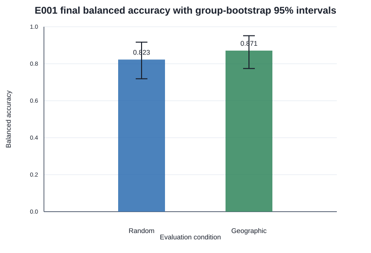
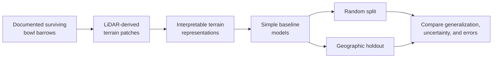

# ArchaeoAI

**Student-led geospatial AI research at the intersection of archaeology, LiDAR terrain, responsible
machine learning, and geographic generalization.**

[](https://github.com/essius10/ArchaeoAI/actions/workflows/ci.yml)


ArchaeoAI tests whether machine learning can recognize the terrain signature of **documented bowl
barrows** in public LiDAR-derived terrain—and whether that signal survives leakage-resistant
evaluation on geographically new groups.

## Results

| Evidence | Balanced accuracy | Interpretation |
|---|---:|---|
| Frozen geographic final test | **87.1%** | Specific two-group holdout; n=62; primary confirmatory result |
| Five-fold geographic RF robustness | **82.3% mean** | Post-hoc robustness across 23 coarse groups |
| Compact CNN comparison | **70.1% mean** | Worse than the RF on every fold; RF retained |
| Independent external test | **84.2% [77.5–90.0%]** | n=120 across five pre-specified 25 km cells; test spent |
| Phase 2F-B | **One controlled run complete** | 5,929 private windows; blinded review pending |

> [!IMPORTANT]
> **Active research, not a discovery system.** The 0.871 balanced accuracy result (87.1%) applies only
> to the frozen test of two
> geographically held-out groups—not England as a whole. Model scores are not archaeological
> probabilities. ArchaeoAI has not discovered archaeological sites. One bounded private domain has
> been scored for terrain similarity, but no human morphology review or heritage cross-check has
> occurred and no candidate location is public.



*Coordinate-safe aggregate evaluation; no sites, maps, or candidate locations are shown.*

## Public research demo

The repository now includes a lightweight, coordinate-safe public research demo in
[`website/`](website/README.md). It presents the verified E001 evidence, geographic-validation
rationale, negative CNN result, privacy boundaries, and current review status without publishing
candidate-level material. It is prepared for a future GitHub Pages or Vercel deployment, but no
deployment is enabled yet.

Preview it locally from the repository root with `python -m http.server 8000`, then open
`http://127.0.0.1:8000/website/`.

## What is ArchaeoAI?

> **Can a model recognize the terrain signature of a documented archaeological earthwork—and does
> that apparent skill survive when the model is tested somewhere geographically new?**

ArchaeoAI is a student-led, reproducible research project built around that question. Its first
experiment, E001, studies **scheduled, surviving single bowl barrows in England** using public
LiDAR-derived terrain. The central concern is not simply whether a model scores well, but whether
the score reflects genuine geographic generalization rather than spatial or survey leakage.

## Current status

| E001 data gate | Verified status |
|---|---:|
| Official Historic England entries reviewed | **360** |
| Records accepted through all Phase 2A.5 gates | **261** |
| Occupied coarse geographic groups | **23** |
| Frozen nonadjacent final-test groups | **2** |
| Automated tests | **238 passing** |
| Real terrain pilot | **5/5 patches passed QA** |
| Full positive terrain dataset | **261/261 acquired and QA-passed** |
| Matched unlabelled backgrounds | **261/261 acquired and QA-passed** |
| Frozen dataset | **522 observations; 254 assignment groups** |
| Geographic final test | **2 nonadjacent blocks; 31 + 31 observations by class** |
| Development selection | **0.821 balanced accuracy; n=28** |
| Random final comparison | **0.823 [0.719, 0.917]; n=62** |
| Primary geographic final result | **0.871 [0.774, 0.952]; n=62** |
| Post-hoc geographic robustness | **5-fold mean 0.823; range 0.790–0.861** |
| Robustness classification | **ROBUST under the frozen Phase 2E-A rule** |
| Post-hoc compact CNN | **5-fold/3-seed mean 0.701; CNN not justified at current scale** |
| First controlled private inference | **5,929/5,929 valid; 1,159 deduplicated; review pending** |
| Independent external evaluation | **0.842 [0.775, 0.900]; n=120; frozen test spent** |
| External error analysis | **Post-hoc/exploratory complete; RF retained** |

The 261 records passed official-entry, single-monument, upstanding-relief, designation-geometry,
128 m terrain-coverage, and survey-provenance checks. They are **curated research
records, not unquestionable ground truth**. A frozen 40-record queue still awaits review by a
different human reviewer.

[Read the post-hoc robustness and sensitivity report →](docs/e001-phase-2e-robustness.md)

[Read the compact-CNN stronger-model comparison →](docs/e001-phase-2eb-compact-cnn.md)

[Read the controlled Random-Forest inference design →](docs/e001-phase-2f-a-controlled-inference.md)

[Read the first controlled private inference report →](docs/e001-phase-2f-b-controlled-inference.md)

[Read the independent external geographic-validation protocol →](docs/e001-phase-3a-external-validation.md)

[Read the one-time independent external evaluation →](docs/e001-phase-3c-external-evaluation.md)

## Why this matters

Airborne LiDAR measures the shape of the ground in fine detail, including beneath some vegetation.
Terrain models derived from it can preserve subtle mounds, banks, ditches, and other morphology
associated with archaeology. Machine learning could eventually help researchers inspect terrain at
scales that are difficult to review manually.

There is a catch: nearby terrain patches often share landscape, survey, and processing history. A
random train/test split can put near-duplicates or closely related places on both sides, making a
model appear more capable than it really is. E001 is therefore designed to compare conventional
random evaluation with **geographically separated holdouts** and to audit acquisition provenance
alongside predictive performance.

A negative result is useful here. If performance collapses in a new region, that is evidence about
the limits of the method—not a failed project.

## How it works

The positive terrain, matched unlabelled backgrounds, and two evaluation conditions were frozen
before modelling. A pre-registered development-only matrix selected and hash-froze the primary
baseline. A separately committed one-way protocol then evaluated random and geographic final
partitions without retuning.



The comparison started with interpretable baselines before testing one frozen compact CNN.
Background terrain is matched by geography and acquisition provenance. An unrecorded location is
called `unlabelled_background`, never a true archaeological negative.

## Research roadmap

| Stage | Status | Evidence / next gate |
|---|---|---|
| Research question and safeguards | ✅ Complete | [Research charter](docs/research-charter.md) |
| Python research foundation | ✅ Complete | Typed config, manifests, safe paths, tests |
| Data-source feasibility | ✅ Complete | [Phase 2A audit](docs/e001-feasibility-audit.md) |
| Primary label curation and metadata QA | ✅ Complete | [Phase 2A.5 gate](docs/e001-phase-2a5-curation-gate.md) |
| Independent label-reliability review | ⏳ Queued | 40-record blinded review queue |
| Bounded terrain acquisition | ✅ Complete | 261/261 private positive patches passed QA |
| Terrain processing and visual QA | ✅ Foundation complete | Deterministic raster QA and four representations |
| Matched background construction | ✅ Complete | 261/261; uncertainty-aware 1:1 design |
| Leakage-resistant split freeze | ✅ Complete | Group-aware random plus two-block geographic test |
| Baseline infrastructure and selection | ✅ Complete | Dummy, L2 logistic, modest random forest |
| Random vs geographic evaluation | ✅ Complete | Geographic 0.871 vs random 0.823 balanced accuracy |
| Robustness and failure analysis | ✅ Complete | Five geographic folds; ablations, seeds, training size, shortcuts |
| Stronger-model comparison | ✅ Complete | CNN 0.701 vs RF 0.823; retain Random Forest |
| Controlled private inference | ✅ Run complete | One 5 km domain; blinded morphology review pending |
| Independent external validation | ✅ Complete | [84.2% balanced accuracy; test spent](docs/e001-phase-3c-external-evaluation.md) |
| External error analysis | ✅ Complete | [Post-hoc/exploratory only](docs/e001-phase-4a-external-error-analysis.md) |
| Technical consolidation | ✅ Complete | [E001 technical results](docs/e001-technical-results.md) |
| Results and research interface | 🔬 Reports complete | Aggregate figures; no sample predictions or map |

## What exists today

- An installable `src/`-layout Python package supporting CPython `>=3.12,<3.15`.
- Strict TOML experiment configuration with path-containment checks.
- Typed dataset manifests with status, licensing, checksum, and sensitivity validation.
- A reproducible NHLE metadata feasibility audit.
- A deterministic 360-record curation queue and controlled review schema.
- Coordinate-safe geometry, terrain-coverage, provenance, grouping, and holdout checks.
- A bounded EA WCS acquisition client with private NHLE location reconstruction.
- Deterministic 128 m raster extraction, 5 km grid discovery, cross-tile mosaics, and reason-coded QA.
- Four tested terrain views: normalized elevation, slope, fixed hillshade, and local relief.
- A coordinate-safe 261-patch positive-terrain index, freeze audit, and overlap constraints.
- A deterministic 261-patch unlabelled-background index with positive, Scheduled Monument,
  provenance, geography, and spacing controls.
- A coordinate-safe 522-record modelling index and frozen group-aware random and complete-block
  geographic train/development/final-test manifests.
- Private-window leakage audits and aggregate elevation, slope, relief, provenance, geography, and
  modern-confound evidence.
- A fail-closed terrain-only model loader, deterministic 4×4 pooling, and three pre-registered
  scikit-learn baseline families.
- A development-only 15-candidate result matrix and hash-frozen primary Random Forest configuration.
- A one-way final evaluation with group-bootstrap uncertainty, confusion matrices, ROC/PR curves,
  aggregate error analysis, and a no-retuning audit trail.
- A score-independent five-fold post-hoc robustness analysis with representation, seed, training-
  size, permutation, correlation, score-distribution, and serialization/offset diagnostics.
- A frozen, privacy-safe 59,145-parameter compact-CNN protocol plus 15-run geographic evaluation,
  aggregate diagnostics, and a no-retuning record.
- A hash-bound full-data Random Forest and reusable controlled-inference engine with deterministic
  patching, ranking, deduplication, blinded review queues, and aggregate-only outputs.
- One bounded private 5 km inference run with 5,929 valid windows, a hash-frozen private score
  table, and a 62-item blinded morphology-review packet.
- Tracked aggregate evidence and a claims register that limits public wording.
- Windows-compatible environment and repository validation scripts.

## What does not exist yet

- Any committed LiDAR, exact coordinate table, georeferenced QA image, or private receipt.
- A deep-learning advantage, independent reproduction, or evidence beyond the bounded E001 classes
  and evaluated coarse geographic groups.
- A hard-background stress dataset with complete model-independent confound annotations.
- A map of predictions or coordinates for possible unrecorded sites.
- A completed human morphology review, heritage-record cross-check, candidate claim, or public
  candidate table.
- A formal paper, DOI, archived release, or institutional affiliation.

## Reproducibility

The reference/reproducibility runtime is CPython 3.12. Development is supported on CPython
`>=3.12,<3.15`; the current Windows environment was last verified on CPython 3.14.7.

```powershell
python -m venv .venv
.\.venv\Scripts\python.exe -m pip install -e ".[dev]"

.\scripts\doctor.ps1
.\scripts\validate_project.ps1
.\.venv\Scripts\python.exe -m pytest
.\.venv\Scripts\python.exe -m ruff check .
.\.venv\Scripts\python.exe -m ruff format --check .
```

Runtime dependencies are NumPy, Rasterio, PyProj, scikit-learn, and PyTorch. The development extra
adds pytest and Ruff. CPython 3.14.7 is verified locally; CPython 3.12 remains the reference runtime
but has not been reproduced on this machine because it is not installed.

<details>
<summary><strong>Reproduce the coordinate-safe metadata audits</strong></summary>

```powershell
# Phase 2A: official NHLE designation-metadata feasibility audit
.\.venv\Scripts\python.exe .\scripts\audit_nhle_bowl_barrows.py

# Phase 2A.5: print the deterministic review queue
.\.venv\Scripts\python.exe .\scripts\curate_e001_labels.py --print-queue

# Rerun the metadata gate (requires the ignored local review cache)
.\.venv\Scripts\python.exe .\scripts\curate_e001_labels.py --terrain-workers 2
```

These commands query official metadata services. They do not download LiDAR or retain exact
coordinates in tracked outputs. The Phase 2A.5 input and recreation policy is documented in
[`data/README.md`](data/README.md).

```powershell
# CONTROLLED: creates an ignored 261-site coordinate cache from official IDs
.\.venv\Scripts\python.exe .\scripts\reconstruct_e001_sites.py

# CONTROLLED: repeats the bounded five-site pilot in ignored private storage
.\.venv\Scripts\python.exe .\scripts\acquire_e001_terrain_pilot.py --count 5

# CONTROLLED: resumable full acquisition; skips every valid cached patch
.\.venv\Scripts\python.exe .\scripts\acquire_e001_full_terrain.py --workers 2

# CONTROLLED: revalidates the full cache and prepares private visual QA
.\.venv\Scripts\python.exe .\scripts\audit_e001_full_terrain.py

# CONTROLLED: deterministic staged background acquisition (10, then 40, then 261)
.\.venv\Scripts\python.exe .\scripts\build_e001_backgrounds.py --target-count 10
.\.venv\Scripts\python.exe .\scripts\build_e001_backgrounds.py --target-count 40
.\.venv\Scripts\python.exe .\scripts\build_e001_backgrounds.py --target-count 261

# Prepare/finalize private background visual QA, freeze splits, and audit leakage
.\.venv\Scripts\python.exe .\scripts\audit_e001_background_pilot.py
.\.venv\Scripts\python.exe .\scripts\freeze_e001_splits.py
.\.venv\Scripts\python.exe .\scripts\audit_e001_dataset.py

# Phase 2D-A only: train/development matrix; the loader rejects final_test
.\.venv\Scripts\python.exe .\scripts\run_e001_development_baselines.py

# Phase 2D-B result files are immutable; do not rerun the exclusive-create final evaluator.
# Coordinate-safe figures can be regenerated only after removing them deliberately in a new audit.

# Historical aggregate-only estimate; downloads no terrain
.\.venv\Scripts\python.exe .\scripts\estimate_e001_terrain_acquisition.py
```

</details>

## Repository map

```text
configs/                 Example experiment configuration
data/manifests/          Tracked provenance metadata, never bulk spatial data
docs/                    Research decisions, audits, methods, and claim limits
experiments/             Pre-specified E001 scientific protocol
outputs/feasibility/     Reviewed, coordinate-safe label-gate evidence
outputs/terrain/         Coordinate-safe pilot and workload evidence
research-log/            Authorship and research-session record
scripts/                 Audit, environment, and project-validation commands
src/archaeoai/           Typed package and deterministic research logic
tests/                   Data-free automated tests
```

## Responsible archaeology

ArchaeoAI evaluates **already documented** earthworks. It does not advise field visits, expose
sensitive locations, or treat a model prediction as archaeological evidence.

- Exact archaeological coordinates, raw designation polygons, restricted datasets, and future
  prediction locations must not be committed.
- Designation boundaries locate protected areas; they are not mound-segmentation masks.
- “Not recorded as archaeology” is not equivalent to a verified negative.
- Geographic groups, acquisition metadata, and uncertainty must remain visible in evaluation.
- Every public claim must link to evidence and stay within the [claims register](docs/claims-register.md).

Please read [SECURITY.md](SECURITY.md) before reporting data exposure and
[CONTRIBUTING.md](CONTRIBUTING.md) before proposing research or code changes.

## Contributing

Thoughtful contributions are welcome in reproducibility, geospatial processing, spatial statistics,
archaeological methodology, baseline evaluation, testing, and documentation. Research-method changes
should begin with an issue so assumptions and evidence standards are visible before implementation.

Start with the [coordinate-safe contribution opportunities](docs/contribution-opportunities.md),
then read the contributor and security guidance below.

If you are interested in reproducible machine learning for archaeology, consider starring the
repository or following the project.

## Citation

No formal paper or DOI exists yet. Until an archived release is available, cite the repository and
the exact commit or version you used. GitHub can generate citation text from
[`CITATION.cff`](CITATION.cff), which intentionally contains no DOI, paper, or affiliation claim.

## Licensing and source attribution

**No repository-wide open-source licence has been applied yet.** Original code and documentation
remain under default copyright while ownership and the separation of original work from OGL-derived
outputs are confirmed. See the [licensing and attribution audit](docs/licensing-and-attribution.md)
before reusing repository content.

Tracked feasibility artifacts contain information derived from public-sector sources:

- © Historic England 2026. For spatial data: Contains Ordnance Survey data © Crown copyright and
  database right 2026. Historic England data was obtained on 27 August 2026.
- © Environment Agency copyright and/or database right 2022. All rights reserved. Source information
  is made available under the Open Government Licence v3.0.

Neither source provider endorses ArchaeoAI. No supplied map is reproduced here.

<details>
<summary><strong>Research documentation</strong></summary>

- [Research charter](docs/research-charter.md)
- [Literature and novelty audit](docs/literature-novelty-audit.md)
- [Dataset decision record](docs/dataset-decision-record.md)
- [E001 Phase 2A feasibility audit](docs/e001-feasibility-audit.md)
- [E001 Phase 2A.5 curation and terrain gate](docs/e001-phase-2a5-curation-gate.md)
- [E001 Phase 2B bounded terrain pilot](docs/e001-phase-2b-terrain.md)
- [E001 Phase 2B.5 full positive-terrain freeze](docs/e001-phase-2b5-full-terrain.md)
- [E001 Phase 2C background and split freeze](docs/e001-phase-2c-background-and-splits.md)
- [E001 Phase 2D-A preregistration](docs/e001-phase-2d-a-preregistration.md)
- [E001 Phase 2D-A development selection](docs/e001-phase-2d-a-development-selection.md)
- [E001 Phase 2D-B frozen protocol](docs/e001-phase-2d-b-final-protocol.md)
- [E001 complete baseline modelling and final results](docs/e001-phase-2d-baseline-modelling.md)
- [E001 Phase 2E-A frozen robustness protocol](docs/e001-phase-2e-a-robustness-protocol.md)
- [E001 Phase 2E-A robustness and failure analysis](docs/e001-phase-2e-robustness.md)
- [E001 Phase 2E-B0 frozen compact-CNN methodology](docs/e001-phase-2eb-compact-cnn.md)
- [Initial E001 experiment protocol](experiments/E001_geographic_baseline.md)
- [Research quality bar](docs/project-quality-bar.md)
- [Claims register](docs/claims-register.md)
- [Decision log](docs/decision-log.md)
- [Roadmap](docs/roadmap.md)
- [Environment audit](docs/environment-audit.md)
- [Student research log](research-log/README.md)

</details>
