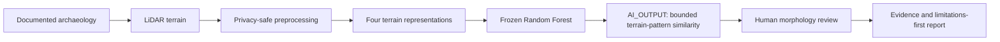
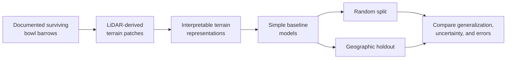

# ArchaeoAI

**Privacy-conscious geospatial machine learning for studying archaeological terrain in LiDAR with
leakage-resistant geographic evaluation and human review.**

[](https://github.com/essius10/ArchaeoAI/actions/workflows/ci.yml)


## In 10 seconds

ArchaeoAI asks whether a machine-learning model can recognize terrain patterns associated with
**documented bowl barrows** in LiDAR-derived terrain and still perform in geographically different
areas. It is reproducible **terrain-pattern screening research**, not archaeological discovery:
scores are not archaeological probabilities, and human review remains necessary.

> **The research hook:** Can a model recognize archaeological terrain patterns when geographic
> separation prevents nearby terrain from leaking between training and testing?

This independently developed, student-led reproducible research project connects archaeology,
remote sensing, terrain analysis, spatial leakage, geographic generalization, Random Forest
baselines, responsible AI, and human review.

## Why this repository is interesting

- Geographic holdouts and provenance audits make spatial leakage a first-class research question.
- A frozen Random Forest is evaluated across a final geographic test, five robustness folds, and a
  separate external dataset.
- A compact CNN underperformed the simpler baseline; the negative result is retained transparently.
- Sensitive locations, private terrain, and candidate material stay outside the public repository.
- An evidence ladder separates `AI_OUTPUT` from human review and archaeological interpretation.
- A coordinate-safe research site and synthetic local portal make the work inspectable without
  exposing the private model or real terrain.

## Results snapshot

| Evidence | Balanced accuracy | Interpretation |
|---|---:|---|
| Frozen geographic final test | **87.1%** | Specific two-group holdout; n=62; primary confirmatory result |
| Five-fold geographic RF robustness | **82.3% mean** | Post-hoc robustness across 23 coarse groups |
| Compact CNN comparison | **70.1% mean** | Worse than the RF on every fold; RF retained |
| Independent external test | **84.2%; 95% CI 77.5–90.0%** | n=120 across five pre-specified 25 km cells; test spent |

E001 retained 261 curated positive records across 23 coarse groups; 12 groups met the provisional
viability threshold. The frozen result covers two geographically held-out groups.
It reached 0.871 balanced accuracy. ArchaeoAI has not discovered archaeological sites.

> [!IMPORTANT]
> These results are bounded to E001's documented bowl-barrow classification design; they are not
> England-wide detection performance. The external test is spent. ArchaeoAI makes no archaeological
> discovery claim. The exact status is `RQ1_PROVISIONALLY_ANSWERED_PENDING_REVIEW`; Phase 5E is
> **NOT COMPLETED**, and Phase 5F is **NOT AUTHORIZED**.


*Coordinate-safe aggregate evaluation; no sites, maps, or candidate locations are shown.*

## Architecture snapshot



`AI_OUTPUT` is a screening observation. It does not become an archaeological identification,
probability, or discovery without stronger independent evidence and accountable human review.

## Try the repository

The public clone supports tests, coordinate-safe evidence inspection, a static research site, and a
**synthetic** local portal:

```powershell
git clone https://github.com/essius10/ArchaeoAI.git
cd ArchaeoAI
python -m venv .venv
.\.venv\Scripts\python.exe -m pip install -e ".[dev]"
.\.venv\Scripts\python.exe -m pytest
.\.venv\Scripts\archaeoai.exe portal --demo --reset
```

Open `http://127.0.0.1:8000`. The approved private model artifact is intentionally unavailable in
normal public clones; do not attempt to obtain it. For macOS/Linux commands and complete checks,
use the [reproducibility guide](docs/reproducibility.md). To preview the coordinate-safe research
site instead, run `python -m http.server 8000` and open `http://127.0.0.1:8000/website/`.

## Start here

| Want to… | Go here |
|---|---|
| Understand the current evidence and limits | [Current status](docs/CURRENT_STATUS.md) and [manuscript draft](docs/manuscript/archaeoai-e001-manuscript.md) |
| Reproduce the public evidence | [Reproducibility guide](docs/reproducibility.md) |
| Review the science | [Reviewer guide](docs/review/REVIEWER_GUIDE.md) |
| Review security and privacy | [Phase 5E review package](docs/review/PHASE_5E_REVIEW_PACKAGE.md) |
| Understand the inference design | [Phase 5 architecture](docs/architecture/PHASE_5_INFERENCE_ARCHITECTURE.md) |
| Try the synthetic portal | [Portal runbook](docs/product/PORTAL_RUNBOOK.md) |
| Contribute safely | [Contributing guide](CONTRIBUTING.md) |

If you find the research or its approach to responsible geospatial ML useful, consider starring the
repository to follow its development.

## Why this matters

Airborne LiDAR measures the shape of the ground in fine detail, including beneath some vegetation.
Terrain models derived from it can preserve subtle mounds, banks, ditches, and other morphology
associated with archaeology. Machine learning could eventually help researchers inspect terrain at
scales that are difficult to review manually.

There is a catch: nearby terrain patches often share landscape, survey, and processing history. A
random train/test split can put near-duplicates or closely related places on both sides, making a
model appear more capable than it really is. E001 is therefore designed to compare conventional
random evaluation with **geographically separated holdouts** and to audit acquisition provenance
alongside predictive performance.

A negative result is useful here. If performance collapses in a new region, that is evidence about
the limits of the method—not a failed project.

## How it works

The positive terrain, matched unlabelled backgrounds, and two evaluation conditions were frozen
before modelling. A pre-registered development-only matrix selected and hash-froze the primary
baseline. A separately committed one-way protocol then evaluated random and geographic final
partitions without retuning.



The comparison started with interpretable baselines before testing one frozen compact CNN.
Background terrain is matched by geography and acquisition provenance. An unrecorded location is
called `unlabelled_background`, never a true archaeological negative.

## Research roadmap

| Stage | Status | Evidence / next gate |
|---|---|---|
| Research question and safeguards | ✅ Complete | [Research charter](docs/research-charter.md) |
| Python research foundation | ✅ Complete | Typed config, manifests, safe paths, tests |
| Data-source feasibility | ✅ Complete | [Phase 2A audit](docs/e001-feasibility-audit.md) |
| Primary label curation and metadata QA | ✅ Complete | [Phase 2A.5 gate](docs/e001-phase-2a5-curation-gate.md) |
| Independent label-reliability review | ⏳ Queued | 40-record blinded review queue |
| Bounded terrain acquisition | ✅ Complete | 261/261 private positive patches passed QA |
| Terrain processing and visual QA | ✅ Foundation complete | Deterministic raster QA and four representations |
| Matched background construction | ✅ Complete | 261/261; uncertainty-aware 1:1 design |
| Leakage-resistant split freeze | ✅ Complete | Group-aware random plus two-block geographic test |
| Baseline infrastructure and selection | ✅ Complete | Dummy, L2 logistic, modest random forest |
| Random vs geographic evaluation | ✅ Complete | Geographic 0.871 vs random 0.823 balanced accuracy |
| Robustness and failure analysis | ✅ Complete | Five geographic folds; ablations, seeds, training size, shortcuts |
| Stronger-model comparison | ✅ Complete | CNN 0.701 vs RF 0.823; retain Random Forest |
| Controlled private inference | ✅ Run complete | One 5 km domain; blinded morphology review pending |
| Independent external validation | ✅ Complete | [84.2% balanced accuracy; test spent](docs/e001-phase-3c-external-evaluation.md) |
| External error analysis | ✅ Complete | [Post-hoc/exploratory only](docs/e001-phase-4a-external-error-analysis.md) |
| Manuscript and reproducibility package | ✅ Ready for review | [Draft manuscript](docs/manuscript/archaeoai-e001-manuscript.md); no release executed |
| Technical consolidation | ✅ Complete | [E001 technical results](docs/e001-technical-results.md) |
| Inference-system architecture | ✅ Phase 5A complete | Contracts and safety boundaries only; no model executed |
| Single-patch inference core | ✅ Phase 5B complete | Bit-exact synthetic feature equivalence; no private model executed |
| Offline single-patch CLI | ✅ Phase 5C complete | Inspect/features available; model execution not authorized |
| Bounded batch feature orchestration | ✅ Phase 5D complete | 64-item hard cap; no retention or model execution |
| Results and research interface | 🔬 Reports complete | Aggregate figures; no sample predictions or map |

## What exists today

- An installable `src/`-layout Python package supporting CPython `>=3.12,<3.15`.
- Strict TOML experiment configuration with path-containment checks.
- Typed dataset manifests with status, licensing, checksum, and sensitivity validation.
- A reproducible NHLE metadata feasibility audit.
- A deterministic 360-record curation queue and controlled review schema.
- Coordinate-safe geometry, terrain-coverage, provenance, grouping, and holdout checks.
- A bounded EA WCS acquisition client with private NHLE location reconstruction.
- Deterministic 128 m raster extraction, 5 km grid discovery, cross-tile mosaics, and reason-coded QA.
- Four tested terrain views: normalized elevation, slope, fixed hillshade, and local relief.
- A coordinate-safe 261-patch positive-terrain index, freeze audit, and overlap constraints.
- A deterministic 261-patch unlabelled-background index with positive, Scheduled Monument,
  provenance, geography, and spacing controls.
- A coordinate-safe 522-record modelling index and frozen group-aware random and complete-block
  geographic train/development/final-test manifests.
- Private-window leakage audits and aggregate elevation, slope, relief, provenance, geography, and
  modern-confound evidence.
- A fail-closed terrain-only model loader, deterministic 4×4 pooling, and three pre-registered
  scikit-learn baseline families.
- A development-only 15-candidate result matrix and hash-frozen primary Random Forest configuration.
- A one-way final evaluation with group-bootstrap uncertainty, confusion matrices, ROC/PR curves,
  aggregate error analysis, and a no-retuning audit trail.
- A score-independent five-fold post-hoc robustness analysis with representation, seed, training-
  size, permutation, correlation, score-distribution, and serialization/offset diagnostics.
- A frozen, privacy-safe 59,145-parameter compact-CNN protocol plus 15-run geographic evaluation,
  aggregate diagnostics, and a no-retuning record.
- A hash-bound full-data Random Forest and reusable controlled-inference engine with deterministic
  patching, ranking, deduplication, blinded review queues, and aggregate-only outputs.
- A Phase 5A fail-closed input contract, evidence ladder, safe result envelope, private-model
  availability guard, and reviewed architecture for possible later inference work.
- A Phase 5B single-patch adapter that reuses the frozen four-channel 4 × 4 feature path and proves
  bit-exact equivalence on coordinate-free synthetic terrain using an inert test double only.
- A Phase 5C offline CLI that validates one canonical GeoTIFF and reports the safe 4,096-feature
  contract without exposing feature values, paths, coordinates, arbitrary tags, or model scores.
- A Phase 5D `batch-features` command with strict JSON admission, deterministic item ordering,
  resource and duplicate limits, per-item validation, aggregate reporting, and no input retention.
- One bounded private 5 km inference run with 5,929 valid windows, a hash-frozen private score
  table, and a 62-item blinded morphology-review packet.
- Tracked aggregate evidence and a claims register that limits public wording.
- Windows-compatible environment and repository validation scripts.

## What does not exist yet

- Any committed LiDAR, exact coordinate table, georeferenced QA image, or private receipt.
- A deep-learning advantage, independent reproduction, or evidence beyond the bounded E001 classes
  and evaluated coarse geographic groups.
- A hard-background stress dataset with complete model-independent confound annotations.
- A map of predictions or coordinates for possible unrecorded sites.
- A completed human morphology review, heritage-record cross-check, candidate claim, or public
  candidate table.
- A peer-reviewed paper, DOI, archived release, or institutional affiliation. The Phase 4B
  manuscript is a review draft only.
- A public model artifact, model-backed public inference, inference API, terrain upload service, or
  authorization to run the Phase 5 core on real user terrain. The offline Phase 5C CLI deliberately
  stops before model execution.

## Offline single-patch CLI

Phase 5C provides a package-native, offline engineering interface for one synthetic or otherwise
authorized local GeoTIFF. It does not download, load, deserialize, or execute a model. The input
must be a single-band 128 × 128 GeoTIFF at 1 m square resolution in EPSG:27700; the CLI never crops,
resamples, or reprojects it.

```powershell
python -m archaeoai --help
python -m archaeoai inspect synthetic_patch.tif
python -m archaeoai features synthetic_patch.tif --json
python -m archaeoai infer synthetic_patch.tif
```

After editable installation, `archaeoai` is equivalent to `python -m archaeoai`. `inspect` emits a
strict coordinate-free QA summary. `features` computes the exact Phase 5B path but reports only its
shape, dtype, and channel order—never the 4,096 values. `infer` is a fail-closed boundary: without
the approved private artifact it exits with code 3, and Phase 5C never authorizes model execution
even if artifact integrity can be verified. No score is fabricated.

## Bounded batch feature preparation

Phase 5D extends the offline engineering boundary to a small local collection without enabling
model inference. A strict JSON manifest may contain at most 64 items. Each opaque ID must match
`item-0001` style, and each terrain reference must be a relative POSIX path beneath the manifest's
directory. Absolute paths, traversal, symbolic links, duplicate IDs, duplicate references, and
byte-identical files are rejected before terrain processing.

```powershell
python -m archaeoai batch-features synthetic_batch.json
python -m archaeoai batch-features synthetic_batch.json --json
```

The manifest schema is demonstrated in
[`configs/phase5d-batch.example.json`](configs/phase5d-batch.example.json). Each file remains subject
to the Phase 5C canonical GeoTIFF contract. Processing is sequential in ascending opaque item-ID
order. Controlled invalid rasters are explicitly counted while other admitted items continue; an
admission or unexpected operational failure stops the batch. The CLI copies no input, creates no
temporary file or cache, discards each feature vector after use, and reports no path, coordinate,
raster metadata, raw feature, model score, or timing value. The approved model remains unavailable
and unexecuted.

## Reproducibility

The reference/reproducibility runtime is CPython 3.12. Development is supported on CPython
`>=3.12,<3.15`; the current Windows environment was last verified on CPython 3.14.7.

```powershell
python -m venv .venv
.\.venv\Scripts\python.exe -m pip install -e ".[dev]"

.\scripts\doctor.ps1
.\scripts\validate_project.ps1
.\.venv\Scripts\python.exe -m pytest
.\.venv\Scripts\python.exe -m ruff check .
.\.venv\Scripts\python.exe -m ruff format --check .
```

On Linux or macOS, use the data-free cross-platform environment check:

```bash
python3 -m venv .venv
source .venv/bin/activate
python -m pip install -e ".[dev]"
python scripts/doctor.py
python -m pytest
python -m ruff check .
python -m ruff format --check .
```

Runtime dependencies are NumPy, Rasterio, PyProj, scikit-learn, and PyTorch. The development extra
adds pytest and Ruff. CPython 3.14.7 is verified locally; CPython 3.12 remains the reference runtime
but has not been reproduced on this machine because it is not installed.

<details>
<summary><strong>Reproduce the coordinate-safe metadata audits</strong></summary>

```powershell
# Phase 2A: official NHLE designation-metadata feasibility audit
.\.venv\Scripts\python.exe .\scripts\audit_nhle_bowl_barrows.py

# Phase 2A.5: print the deterministic review queue
.\.venv\Scripts\python.exe .\scripts\curate_e001_labels.py --print-queue

# Rerun the metadata gate (requires the ignored local review cache)
.\.venv\Scripts\python.exe .\scripts\curate_e001_labels.py --terrain-workers 2
```

These commands query official metadata services. They do not download LiDAR or retain exact
coordinates in tracked outputs. The Phase 2A.5 input and recreation policy is documented in
[`data/README.md`](data/README.md).

```powershell
# CONTROLLED: creates an ignored 261-site coordinate cache from official IDs
.\.venv\Scripts\python.exe .\scripts\reconstruct_e001_sites.py

# CONTROLLED: repeats the bounded five-site pilot in ignored private storage
.\.venv\Scripts\python.exe .\scripts\acquire_e001_terrain_pilot.py --count 5

# CONTROLLED: resumable full acquisition; skips every valid cached patch
.\.venv\Scripts\python.exe .\scripts\acquire_e001_full_terrain.py --workers 2

# CONTROLLED: revalidates the full cache and prepares private visual QA
.\.venv\Scripts\python.exe .\scripts\audit_e001_full_terrain.py

# CONTROLLED: deterministic staged background acquisition (10, then 40, then 261)
.\.venv\Scripts\python.exe .\scripts\build_e001_backgrounds.py --target-count 10
.\.venv\Scripts\python.exe .\scripts\build_e001_backgrounds.py --target-count 40
.\.venv\Scripts\python.exe .\scripts\build_e001_backgrounds.py --target-count 261

# Prepare/finalize private background visual QA, freeze splits, and audit leakage
.\.venv\Scripts\python.exe .\scripts\audit_e001_background_pilot.py
.\.venv\Scripts\python.exe .\scripts\freeze_e001_splits.py
.\.venv\Scripts\python.exe .\scripts\audit_e001_dataset.py

# Phase 2D-A only: train/development matrix; the loader rejects final_test
.\.venv\Scripts\python.exe .\scripts\run_e001_development_baselines.py

# Phase 2D-B result files are immutable; do not rerun the exclusive-create final evaluator.
# Coordinate-safe figures can be regenerated only after removing them deliberately in a new audit.

# Historical aggregate-only estimate; downloads no terrain
.\.venv\Scripts\python.exe .\scripts\estimate_e001_terrain_acquisition.py
```

</details>

## Repository map

```text
configs/                 Example experiment configuration
data/manifests/          Tracked provenance metadata, never bulk spatial data
docs/                    Research decisions, audits, methods, and claim limits
docs/architecture/       Future-system designs and explicit engineering boundaries
experiments/             Pre-specified E001 scientific protocol
outputs/feasibility/     Reviewed, coordinate-safe label-gate evidence
outputs/terrain/         Coordinate-safe pilot and workload evidence
research-log/            Authorship and research-session record
scripts/                 Audit, environment, and project-validation commands
src/archaeoai/           Typed package and deterministic research logic
tests/                   Data-free automated tests
```

## Responsible archaeology

ArchaeoAI evaluates **already documented** earthworks. It does not advise field visits, expose
sensitive locations, or treat a model prediction as archaeological evidence.

- Exact archaeological coordinates, raw designation polygons, restricted datasets, and future
  prediction locations must not be committed.
- Designation boundaries locate protected areas; they are not mound-segmentation masks.
- “Not recorded as archaeology” is not equivalent to a verified negative.
- Geographic groups, acquisition metadata, and uncertainty must remain visible in evaluation.
- Every public claim must link to evidence and stay within the [claims register](docs/claims-register.md).

Please read [SECURITY.md](SECURITY.md) before reporting data exposure and
[CONTRIBUTING.md](CONTRIBUTING.md) before proposing research or code changes.

## Contributing

Thoughtful contributions are welcome in reproducibility, geospatial processing, spatial statistics,
archaeological methodology, baseline evaluation, testing, and documentation. Research-method changes
should begin with an issue so assumptions and evidence standards are visible before implementation.

Start with the [coordinate-safe contribution opportunities](docs/contribution-opportunities.md),
then read the contributor and security guidance below. Coordinate-safe, community-specific sharing
drafts are available in the [GitHub launch kit](docs/outreach/GITHUB_LAUNCH_KIT.md); the
[social-preview specification](docs/outreach/SOCIAL_PREVIEW_SPEC.md) remains unconfigured.

## Citation

No formal paper or DOI exists yet. Until an archived release is available, cite the repository and
the exact commit or version you used. GitHub can generate citation text from
[`CITATION.cff`](CITATION.cff), which intentionally contains no DOI, paper, or affiliation claim.

## Licensing and source attribution

**No repository-wide open-source licence has been applied yet.** Original code and documentation
remain under default copyright while ownership and the separation of original work from OGL-derived
outputs are confirmed. See the [licensing and attribution audit](docs/licensing-and-attribution.md)
before reusing repository content.

Tracked feasibility artifacts contain information derived from public-sector sources:

- © Historic England 2026. For spatial data: Contains Ordnance Survey data © Crown copyright and
  database right 2026. Historic England data was obtained on 27 August 2026.
- © Environment Agency copyright and/or database right 2022. All rights reserved. Source information
  is made available under the Open Government Licence v3.0.

Neither source provider endorses ArchaeoAI. No supplied map is reproduced here.

<details>
<summary><strong>Research documentation</strong></summary>

- [E001 manuscript draft](docs/manuscript/archaeoai-e001-manuscript.md)
- [Reproducibility guide](docs/reproducibility.md)
- [Phase 5 inference-system architecture](docs/architecture/PHASE_5_INFERENCE_ARCHITECTURE.md)
- [Citation audit](docs/citation-audit.md)
- [Future release checklist](docs/release-checklist.md)
- [Research charter](docs/research-charter.md)
- [Literature and novelty audit](docs/literature-novelty-audit.md)
- [Dataset decision record](docs/dataset-decision-record.md)
- [E001 Phase 2A feasibility audit](docs/e001-feasibility-audit.md)
- [E001 Phase 2A.5 curation and terrain gate](docs/e001-phase-2a5-curation-gate.md)
- [E001 Phase 2B bounded terrain pilot](docs/e001-phase-2b-terrain.md)
- [E001 Phase 2B.5 full positive-terrain freeze](docs/e001-phase-2b5-full-terrain.md)
- [E001 Phase 2C background and split freeze](docs/e001-phase-2c-background-and-splits.md)
- [E001 Phase 2D-A preregistration](docs/e001-phase-2d-a-preregistration.md)
- [E001 Phase 2D-A development selection](docs/e001-phase-2d-a-development-selection.md)
- [E001 Phase 2D-B frozen protocol](docs/e001-phase-2d-b-final-protocol.md)
- [E001 complete baseline modelling and final results](docs/e001-phase-2d-baseline-modelling.md)
- [E001 Phase 2E-A frozen robustness protocol](docs/e001-phase-2e-a-robustness-protocol.md)
- [E001 Phase 2E-A robustness and failure analysis](docs/e001-phase-2e-robustness.md)
- [E001 Phase 2E-B0 frozen compact-CNN methodology](docs/e001-phase-2eb-compact-cnn.md)
- [Initial E001 experiment protocol](experiments/E001_geographic_baseline.md)
- [Research quality bar](docs/project-quality-bar.md)
- [Claims register](docs/claims-register.md)
- [Decision log](docs/decision-log.md)
- [Roadmap](docs/roadmap.md)
- [Environment audit](docs/environment-audit.md)
- [Student research log](research-log/README.md)

</details>
