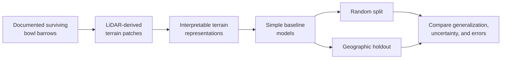

# ArchaeoAI

**LiDAR terrain research, spatial evaluation, and reproducible machine learning for archaeology.**


> **Can a model recognize the terrain signature of a documented archaeological earthwork—and does
> that apparent skill survive when the model is tested somewhere geographically new?**

ArchaeoAI is a student-led, reproducible research project built around that question. Its first
experiment, E001, studies **scheduled, surviving single bowl barrows in England** using public
LiDAR-derived terrain. The central concern is not simply whether a model scores well, but whether
the score reflects genuine geographic generalization rather than spatial or survey leakage.

> [!IMPORTANT]
> **Active research, not a discovery system.** No model has been trained, no performance result
> exists, and ArchaeoAI has not discovered archaeological sites.

## Current research status

| E001 data gate | Verified status |
|---|---:|
| Official Historic England entries reviewed | **360** |
| Records accepted through all Phase 2A.5 gates | **261** |
| Viable provisional geographic groups | **12** |
| Pairwise nonadjacent possible holdouts | **4** |
| Automated tests | **49 passing** |
| Terrain patches acquired | **No—not started** |
| Models trained / results reported | **No / none** |

The 261 records passed official-entry, single-monument, upstanding-relief, designation-geometry,
provisional 128 m terrain-coverage, and survey-provenance checks. They are **curated research
records, not unquestionable ground truth**. A frozen 40-record queue still awaits review by a
different human reviewer.

[Read the complete Phase 2A.5 decision →](docs/e001-phase-2a5-curation-gate.md)

## Why this matters

Airborne LiDAR measures the shape of the ground in fine detail, including beneath some vegetation.
Terrain models derived from it can preserve subtle mounds, banks, ditches, and other morphology
associated with archaeology. Machine learning could eventually help researchers inspect terrain at
scales that are difficult to review manually.

There is a catch: nearby terrain patches often share landscape, survey, and processing history. A
random train/test split can put near-duplicates or closely related places on both sides, making a
model appear more capable than it really is. E001 is therefore designed to compare conventional
random evaluation with **geographically separated holdouts** and to audit acquisition provenance
alongside predictive performance.

A negative result is useful here. If performance collapses in a new region, that is evidence about
the limits of the method—not a failed project.

## The experiment in 30 seconds

Everything after the curated-label gate in this diagram is planned, not yet implemented.



The planned comparison starts with interpretable baselines before any deep-learning experiment.
Background terrain must be matched by geography and acquisition provenance; an unrecorded location
will not be treated automatically as a true archaeological negative.

## Research roadmap

| Stage | Status | Evidence / next gate |
|---|---|---|
| Research question and safeguards | ✅ Complete | [Research charter](docs/research-charter.md) |
| Python research foundation | ✅ Complete | Typed config, manifests, safe paths, tests |
| Data-source feasibility | ✅ Complete | [Phase 2A audit](docs/e001-feasibility-audit.md) |
| Primary label curation and metadata QA | ✅ Complete | [Phase 2A.5 gate](docs/e001-phase-2a5-curation-gate.md) |
| Independent label-reliability review | ⏳ Queued | 40-record blinded review queue |
| Bounded terrain acquisition | ⏳ Not started | Phase 2B approval required |
| Terrain processing and visual QA | ⏳ Not started | No raster pipeline yet |
| Matched background construction | ⏳ Not started | Must preserve uncertainty and provenance |
| Baseline models | ⏳ Not started | Interpretable methods first |
| Random vs geographic evaluation | ⏳ Not started | Final blocks and buffers not frozen |
| Results and research interface | ⏳ Not started | No metrics or public predictions exist |

## What exists today

- An installable `src/`-layout Python package supporting CPython `>=3.12,<3.15`.
- Strict TOML experiment configuration with path-containment checks.
- Typed dataset manifests with status, licensing, checksum, and sensitivity validation.
- A reproducible NHLE metadata feasibility audit.
- A deterministic 360-record curation queue and controlled review schema.
- Coordinate-safe geometry, terrain-coverage, provenance, grouping, and holdout checks.
- Tracked aggregate evidence and a claims register that limits public wording.
- Windows-compatible environment and repository validation scripts.

## What does not exist yet

- Downloaded or committed LiDAR terrain.
- A raster clipping, tiling, or terrain-representation pipeline.
- Matched background samples or a finalized geographic split.
- A trained classifier, deep-learning system, metric, plot, or headline result.
- A map of predictions or coordinates for possible unrecorded sites.
- A formal paper, DOI, archived release, or institutional affiliation.

## Quick start

The reference/reproducibility runtime is CPython 3.12. Development is supported on CPython
`>=3.12,<3.15`; the current Windows environment was last verified on CPython 3.14.7.

```powershell
python -m venv .venv
.\.venv\Scripts\python.exe -m pip install -e ".[dev]"

.\scripts\doctor.ps1
.\scripts\validate_project.ps1
.\.venv\Scripts\python.exe -m pytest
.\.venv\Scripts\python.exe -m ruff check .
.\.venv\Scripts\python.exe -m ruff format --check .
```

Phase 1 has no third-party runtime dependencies. The development extra contains only pytest and
Ruff. Scientific/geospatial dependencies will not be introduced until the relevant phase requires
and verifies them.

<details>
<summary><strong>Reproduce the coordinate-safe metadata audits</strong></summary>

```powershell
# Phase 2A: official NHLE designation-metadata feasibility audit
.\.venv\Scripts\python.exe .\scripts\audit_nhle_bowl_barrows.py

# Phase 2A.5: print the deterministic review queue
.\.venv\Scripts\python.exe .\scripts\curate_e001_labels.py --print-queue

# Rerun the metadata gate (requires the ignored local review cache)
.\.venv\Scripts\python.exe .\scripts\curate_e001_labels.py --terrain-workers 2
```

These commands query official metadata services. They do not download LiDAR or retain exact
coordinates in tracked outputs. The Phase 2A.5 input and recreation policy is documented in
[`data/README.md`](data/README.md).

</details>

## Repository map

```text
configs/                 Example experiment configuration
data/manifests/          Tracked provenance metadata, never bulk spatial data
docs/                    Research decisions, audits, methods, and claim limits
experiments/             Pre-specified E001 scientific protocol
outputs/feasibility/     Reviewed, coordinate-safe gate evidence
research-log/            Authorship and research-session record
scripts/                 Audit, environment, and project-validation commands
src/archaeoai/           Typed package and deterministic research logic
tests/                   Data-free automated tests
```

## Research and data safeguards

ArchaeoAI evaluates **already documented** earthworks. It does not advise field visits, expose
sensitive locations, or treat a model prediction as archaeological evidence.

- Exact archaeological coordinates, raw designation polygons, restricted datasets, and future
  prediction locations must not be committed.
- Designation boundaries locate protected areas; they are not mound-segmentation masks.
- “Not recorded as archaeology” is not equivalent to a verified negative.
- Geographic groups, acquisition metadata, and uncertainty must remain visible in evaluation.
- Every public claim must link to evidence and stay within the [claims register](docs/claims-register.md).

Please read [SECURITY.md](SECURITY.md) before reporting data exposure and
[CONTRIBUTING.md](CONTRIBUTING.md) before proposing research or code changes.

## Contributing

Thoughtful contributions are welcome in reproducibility, geospatial processing, spatial statistics,
archaeological methodology, baseline evaluation, testing, and documentation. Research-method changes
should begin with an issue so assumptions and evidence standards are visible before implementation.

If you are interested in reproducible machine learning for archaeology, consider starring the
repository or following the project.

## Citation

No formal paper or DOI exists yet. Until an archived release is available, cite the repository and
the exact commit or version you used. GitHub can generate citation text from
[`CITATION.cff`](CITATION.cff), which intentionally contains no DOI, paper, or affiliation claim.

## Licensing and source attribution

**No repository-wide open-source licence has been applied yet.** Original code and documentation
remain under default copyright while ownership and the separation of original work from OGL-derived
outputs are confirmed. See the [licensing and attribution audit](docs/licensing-and-attribution.md)
before reusing repository content.

Tracked feasibility artifacts contain information derived from public-sector sources:

- © Historic England 2026. For spatial data: Contains Ordnance Survey data © Crown copyright and
  database right 2026. Historic England data was obtained on 27 August 2026.
- © Environment Agency copyright and/or database right 2022. All rights reserved. Source information
  is made available under the Open Government Licence v3.0.

Neither source provider endorses ArchaeoAI. No supplied map is reproduced here.

<details>
<summary><strong>Research documentation</strong></summary>

- [Research charter](docs/research-charter.md)
- [Literature and novelty audit](docs/literature-novelty-audit.md)
- [Dataset decision record](docs/dataset-decision-record.md)
- [E001 Phase 2A feasibility audit](docs/e001-feasibility-audit.md)
- [E001 Phase 2A.5 curation and terrain gate](docs/e001-phase-2a5-curation-gate.md)
- [Initial E001 experiment protocol](experiments/E001_geographic_baseline.md)
- [Research quality bar](docs/project-quality-bar.md)
- [Claims register](docs/claims-register.md)
- [Decision log](docs/decision-log.md)
- [Roadmap](docs/roadmap.md)
- [Environment audit](docs/environment-audit.md)
- [Student research log](research-log/README.md)

</details>
