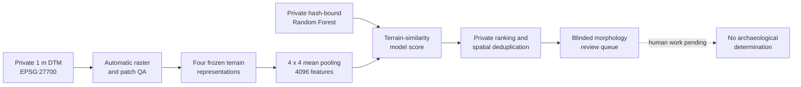
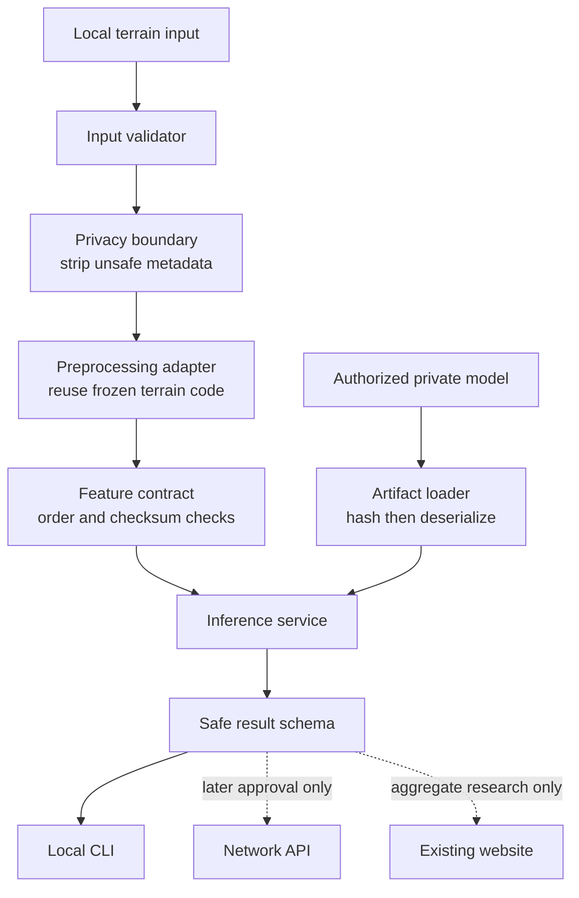

# Phase 5 inference-system architecture

## 1. Purpose and boundary

Phase 5A translated the completed E001 research pipeline into a conservative architecture for a
possible future terrain-inference interface. Phase 5B adds the smallest reusable single-patch
feature and model-adapter boundary, tested only with coordinate-free synthetic terrain and an inert
test double. Phase 5C adds an offline GeoTIFF inspection and feature-contract CLI, tested only with
temporary mathematical terrain. None of these phases loads or executes the approved private model, scores real terrain,
trains or tunes anything, reuses the spent external test, publishes a service, changes a scientific
result, or claims an archaeological discovery.

The scientific state remains `RQ1_PROVISIONALLY_ANSWERED_PENDING_REVIEW`. This architecture is an
engineering plan, not new research evidence or proof that automated inference is safe for public
use.

## 2. Current repository classification

**B — `INFERENCE_CODE_READY_MODEL_ARTIFACT_UNAVAILABLE`.**

The qualification is repository-level: tested inference code exists, and this authorized local
checkout may contain the approved hash-matching private artifact, but that artifact is intentionally
Git-ignored and unavailable from a public clone. A public checkout therefore cannot perform the
approved inference without a separately authorized artifact handoff. Phase 5C provides a supported
offline inspection/features CLI, not model-backed inference or a public API.

This is not classification A because the distributable repository is not self-contained for
inference. It is not C because the core terrain, feature, model-loading, scoring, ranking, and
privacy functions already exist as tested package code. It is not D because frozen protocols,
hashes, tests, and one bounded execution provide direct evidence of the pipeline.

## 3. Existing pipeline inventory

| Concern | Verified implementation |
|---|---|
| Selected model | scikit-learn `RandomForestClassifier`; 300 trees, depth 8, minimum leaf 5, `sqrt` features, `n_jobs=1`, seed 20260829 |
| Model scaling | None; the frozen Random Forest does not use `StandardScaler` |
| Model configuration | `outputs/modelling/e001_primary_baseline_config.json`; configuration SHA-256 `20cd377c17373eeeb5403c84119084287f193d93b42c8004d99c823e01a157e4` |
| Full-fit model state | SHA-256 `e3b0c072f437e889f09a2a2cf5a37f19b2f483eb5188e102b132a89ee76d1939` |
| Serialized artifact | Private pickle below `data/private/e001/inference/`; artifact SHA-256 `50f7968069ecaa1e0016f37be6356531ab3f26802c806efb5dc8fb2e295a503f`; present and matching in the audited authorized checkout, ignored and untracked |
| Terrain | Single-band Environment Agency DTM, EPSG:27700, 1 m pixels |
| Patch | 128 m × 128 m, represented as 128 × 128 pixels; maximum no-data fraction 0.20 |
| Representations | Median-normalized elevation, slope in degrees, 315°/45° hillshade, 16 m local relief |
| Features | Non-overlapping 4 × 4 mean pooling; 32 × 32 × 4 = 4,096 ordered terrain-only values |
| Output semantics | Ranking or terrain-pattern-similarity score, not calibrated archaeological probability |
| Runtime dependencies | NumPy, Rasterio, PyProj, scikit-learn; Torch belongs to the completed CNN comparison and is not required by RF inference |

Reusable package components are in `archaeoai.terrain`, `archaeoai.model_data`,
`archaeoai.inference`, and `archaeoai.inference_system`. The Phase 2F freeze/smoke/run scripts,
controlled-domain binding, output generation, and research receipts are experiment-specific. Phase
5C installs the `archaeoai` offline console command for one local patch. There is no model-backed
public inference, web API, upload handler, authentication layer, retention policy implementation,
or public model distribution mechanism.

Inference can run without retraining only in an authorized environment that already has the exact
private artifact. `load_private_model` checks its artifact and learned-state hashes before scoring.
The existing `fit_frozen_random_forest` function is historical research support and must never be
used as an automatic fallback by a Phase 5 interface.

## 4. Existing research pipeline

The dotted final edge is deliberate: a model result does not cross the human or archaeological
evidence boundary.

## 5. Proposed minimal architecture

The existing `archaeoai.inference` module retains Phase 2F behavior. Converting it directly into a
directory would create an avoidable module/package collision, so new public-boundary work starts in
`archaeoai.inference_system`.

Phase 5A implements the input metadata contract, evidence enum, safe result envelope, and
non-executing artifact checksum guard. Phase 5B adds strict array/mask validation, canonical
feature reuse, the exact one-row model-input contract, an approved private-path/hash gate, and a
minimal model-facing protocol. It still adds no model loader. Future components must depend on
these boundaries rather than bypass them.

Phase 5C adds only file-to-contract plumbing. Rasterio reads one explicitly supplied local GeoTIFF,
the existing Phase 5B adapter creates the feature vector, and a strict reporting allowlist discards
paths, transforms, bounds, coordinates, tags, feature values, and arbitrary metadata. The CLI never
deserializes or invokes a model.

## 6. Input contract

The smallest v1 request is one local, single-band DTM patch with:

- CRS equivalent to EPSG:27700;
- exactly 1 m square pixels;
- exactly 128 × 128 pixels, representing 128 m × 128 m;
- finite elevation values except for an explicit mask/no-data fraction no greater than 0.20;
- elevation units in metres and the existing plausible range checks;
- no implicit resizing, mosaicking, band selection, CRS transformation, or resolution conversion.

Invalid or ambiguous inputs fail closed with stable reasons. Reprojection is a separate future
operation that must produce a new auditable input and cannot silently occur during inference.
Large-raster tiling is also outside the v1 contract; it may be added only after single-patch
equivalence and privacy tests pass.

Exact bounds, transforms, filenames, paths, coordinates, and upload identifiers are sensitive
request context. They may be needed transiently for validation but must not enter model features,
public results, ordinary logs, analytics, URLs, or exception telemetry.

## 7. Deterministic preprocessing contract

After input QA, the adapter must call the existing tested functions without changing parameters:

1. subtract the valid per-patch median from elevation;
2. compute slope in degrees at 1 m resolution;
3. compute hillshade at azimuth 315° and altitude 45°;
4. compute local relief with a 16 m radius;
5. preserve that exact channel order;
6. apply the existing non-overlapping 4 × 4 finite-value mean pool;
7. require exactly 4,096 finite `float32` features.

Any training/inference equivalence difference is a hard stop. There is no learned normalization and
no metadata, coordinate, provenance, date, identifier, filename, or path feature.

### Verified Phase 5B feature trace

The input array may use a real integer or floating NumPy dtype and is converted immediately to
`float32`, matching the research path. Boolean, complex, object, and non-array inputs fail closed.
Unmasked NaN or infinity fails; explicitly masked no-data is accepted only when its fraction exactly
matches metadata and does not exceed 0.20. Metadata must explicitly bind EPSG:27700, two 1 m
resolution axes, one band, and 128 × 128 cells. No shape, resolution, CRS, or no-data repair occurs.

The established implementation computes and concatenates channels in this order:
`elevation_normalized`, `slope_degrees`, `hillshade_315_45`, `local_relief_r16m`. Each 128 × 128
channel is C-order reshaped to `(32, 4, 32, 4)`. Finite values are summed in `float64` and divided by
their counts over the two four-cell axes; a completely masked pooling block retains the established
zero value. The 32 × 32 result is C-order flattened to 1,024 `float32` values. Four channel vectors
are concatenated, without a scaler, into `(4096,)`; the model boundary receives a read-only
`(1, 4096)` matrix. There is no further transformation before the existing research scorer.

Six deterministic synthetic surfaces—plane, smooth mound, smooth depression, sinusoid, seeded
noise, and constant elevation—produced bit-for-bit identical vectors through the research and new
reusable paths using `numpy.array_equal`. This demonstrates implementation equivalence, not model
quality or archaeological performance.

## 8. Output contract and terminology

The public result envelope is constructed from an explicit eight-field allowlist. Every field has a
runtime-enforced public contract:

| Field | Public boundary |
|---|---|
| `schema_version` | Fixed literal owned by the serializer |
| `evidence_level` | `EvidenceLevel` enum instance restricted to `AI_OUTPUT` or `AI_HYPOTHESIS` |
| `terrain_similarity_score` | Finite Python float in `[0, 1]` |
| `score_semantics` | Fixed literal `terrain_pattern_similarity_not_archaeological_probability` |
| `model_identifier` | Approved `ModelIdentifier` enum; its current value is a 1–64 character lowercase alphanumeric/hyphen slug with no paths, URLs, separators, whitespace, control characters, or caller metadata |
| `model_config_sha256` | Exact 64-character lowercase SHA-256 digest bound to the approved model identifier |
| `warnings` | Required `WarningCode` tuple rendered only through fixed coordinate-safe messages |
| `limitations` | Required `LimitationCode` tuple rendered only through fixed coordinate-safe messages |

Caller-supplied strings, mappings, nested containers, and custom objects are rejected at
construction rather than recursively serialized. `private_metadata` is retained only as internal
request context and is not traversed or copied into the public result.

Allowed score descriptions are `terrain-similarity score`, `terrain-pattern-similarity score`,
`bowl-barrow-class score`, or `candidate-ranking score`. The score is not a calibrated probability
that archaeology or a site exists. A value of 0.90 does not mean a 90% chance of archaeology.
Phase 5A defines no new threshold and creates no `site`/`not site` decision.

## 9. Evidence ladder

The machine-readable evidence levels are:

1. `AI_OUTPUT`
2. `AI_HYPOTHESIS`
3. `HUMAN_VETTED_OBSERVATION`
4. `ARCHAEOLOGIST_VALIDATED_INTERPRETATION`
5. `CONFIRMED_ARCHAEOLOGICAL_EVIDENCE`

An automatic inference path may emit only levels 1–2. It cannot infer, copy, promote, or imply a
human, archaeologist, or confirmation status. Higher levels require separately authenticated,
auditable human workflows that do not exist in this repository. Even human visual review of
terrain is not by itself confirmation of archaeology.

## 10. Model-artifact strategy

The current artifact remains private, ignored, and hash-bound. Phase 5B accepts only its exact
approved private relative path, model identifier, configuration digest, and serialized-artifact
digest. The guard reads bytes only and does not deserialize them. A future authorized runtime must:

1. receive the artifact through a non-Git controlled channel;
2. verify the serialized artifact SHA-256 before deserialization;
3. load only the expected scikit-learn model type in a trusted environment;
4. verify the learned model-state SHA-256 and frozen configuration;
5. stop if any check differs;
6. never fit or download a replacement automatically.

Python pickle is code-execution-capable. Hash binding protects integrity, not provenance by itself,
so only the owner-approved artifact may be deserialized. Model redistribution, licensing, and a
safer portable format are unresolved decisions, not assumptions made by Phase 5A.

## 11. Privacy and security boundary

The public serializer is allowlist-based and uses controlled message codes with fixed rendering.
Exact coordinates, extents, transforms, grid references, source filenames, paths, request
identifiers, sample identifiers, private tokens, rasters, derived images, feature vectors,
candidate tables, model files, and checkpoints stay private and ignored.

The Phase 5A final review found that the first contract revision annotated `warnings` and
`limitations` as strings but did not enforce those types at runtime, and accepted any non-empty
model identifier. Fictional path, nested-object, and unsafe-claim probes could therefore reach the
public payload. The corrected contract fails closed on those values, requires the full safety-code
set, binds an approved identifier enum to its frozen configuration digest, and renders only fixed
messages. This was a contract defect, not a scientific-result or private-data incident; no deployed
interface existed and no real inference was run.

Future interfaces must use local processing by default, bounded file size and raster dimensions,
content-type verification, decompression limits, time/memory limits, temporary directories with
deterministic cleanup, disabled outbound callbacks, redacted errors, and no input retention by
default. Server-side processing, telemetry, or persistence requires explicit privacy review and
user consent. A public map of model outputs is not authorized.

## 12. Reproducibility boundary

The canonical scientific results remain immutable. Phase 5 must bind the existing configuration,
model-state, representation order, library versions, and artifact checksum without regenerating
Phase 2D, 2E, 3C, or 4A outputs. Synthetic fixtures may test numerical equivalence. A private
artifact check may verify bytes without model execution.

Public clones can reproduce contracts and synthetic preprocessing tests, but cannot reproduce
approved inference without private terrain and the private model artifact. That limitation must be
reported, not hidden behind automatic retraining.

## 13. CLI and API boundary

No CLI or API is added in Phase 5A. Phase 5C now implements the smallest offline interface for one
validated local patch:

- `archaeoai inspect TERRAIN.tif [--json]` validates and reports a fixed coordinate-free raster QA
  allowlist;
- `archaeoai features TERRAIN.tif [--json]` computes the exact frozen feature path but reports only
  shape, dtype, and representation order;
- `archaeoai infer TERRAIN.tif [--model PRIVATE_MODEL.pkl] [--json]` defines the future production
  boundary but always stops before model loading or execution in Phase 5C.

`python -m archaeoai` provides the same interface. The reader accepts only the GeoTIFF driver, one
band, 128 × 128 pixels, EPSG:27700, 1 m square resolution, and the frozen finite/no-data rules. It
does not crop, select bands, resize, resample, reproject, fill, or repair inputs. Human and JSON
outputs use fixed labels rather than filenames and never expose paths, coordinates, bounds,
transforms, arbitrary tags, feature values, model locations, or scores.

Exit behavior is deterministic:

| Code | Meaning |
|---:|---|
| 0 | Successful inspection or feature preparation |
| 2 | Usage, file, format, or canonical-input failure |
| 3 | Approved model unavailable or execution not authorized |
| 4 | Artifact-integrity failure |
| 5 | Model identity, configuration, or private-path mismatch |
| 10 | Bounded internal operational failure |

A network API is later and optional. It requires authentication, abuse controls, privacy and
licensing review, bounded uploads, deletion guarantees, an audit trail, and independent threat
review. It must never accept a request to label a location as confirmed archaeology.

## 14. Website boundary

The existing static website remains a coordinate-safe research summary. It is not an inference
client and is unchanged by Phase 5A. A future website may explain the evidence ladder and link to
documentation; it must not upload terrain, call an inference endpoint, show candidates, expose
locations, or imply discovery unless a later phase receives explicit approval and passes all
privacy, licensing, human-review, and security gates.

## 15. Required tests before any real inference

Before Phase 5 may score real user terrain, tests must cover:

- exact input CRS, resolution, dimensions, band count, units, no-data, range, and failure reasons;
- malicious/corrupt raster handling, size limits, decompression limits, and cleanup;
- byte/hash/type/state verification before model deserialization;
- explicit absence behavior with no retraining or fabricated output;
- numerical equivalence with the frozen Phase 2F representation and feature path;
- channel order, feature count, determinism, and CPU compatibility;
- automatic evidence-level limits and safe score terminology;
- allowlist serialization, controlled warning/limitation codes, strict model identifiers,
  deterministic JSON safety, log redaction, and coordinate/private-metadata exclusion;
- concurrency, timeout, memory, and partial-failure behavior;
- frozen artifact, claim, citation, licensing, manuscript, website, and spent-test immutability;
- a separately authorized synthetic end-to-end run before any private real-input run.

## 16. Phase 5 sequence and gates

| Phase | Smallest authorized scope | Exit gate |
|---|---|---|
| 5A | Architecture, inventory, contracts, and boundary tests | **Complete; no inference executed** |
| 5B | Single-patch preprocessing/model adapter on synthetic data only | **Complete; exact equivalence and fail-closed tests pass** |
| 5C | Offline local single-patch CLI | **Complete and ready for review; synthetic validation only; model execution disabled** |
| 5D | Bounded private batch orchestration, still non-public | Resource, cleanup, retention, abuse, and aggregate-reporting tests pass |
| 5E | Independent security, privacy, archaeological-workflow, and licensing review | Named findings resolved or documented; owner explicitly approves next step |
| 5F | Optional public interface or deployment decision | Separate deployment authorization; may legitimately end in `NO-GO` |

No phase inherits permission to score real terrain, deploy a service, or publish locations from the
completion of an earlier phase.

## 17. Scientific limits and non-goals

This architecture does not change E001's class, labels, data, splits, model, threshold, metrics, or
claims. The spent external test remains spent. Backgrounds remain `unlabelled_background`, not
known negatives. The result concerns learned terrain similarity for a narrowly curated bowl-barrow
study; it is not England-wide archaeological detection, calibrated site probability, field advice,
or evidence of discovery.

Phase 5A, Phase 5B, and Phase 5C do not train, tune, score real terrain, benchmark a real model, acquire
terrain, rerun research, review candidates, cross-check heritage records, expose private material,
build a website feature, publish a release, or deploy an API. Phase 5B's inert test-double score has
zero scientific meaning; Phase 5C exposes no score. Independent scientific/privacy review, label-reliability review,
systematic literature work, authorized private-data reproduction, licensing decisions, artifact
distribution, and operational security review remain external blockers.

Phase 5A does not train, tune, score, or execute a model; Phase 5B and Phase 5C do not change that
scientific boundary.
