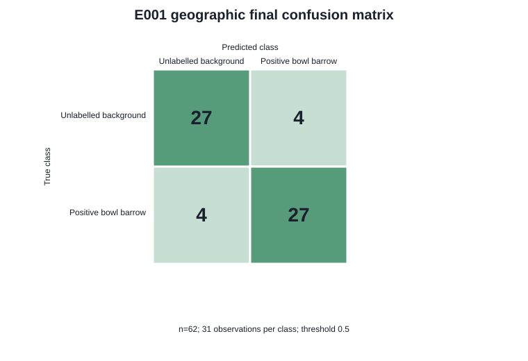
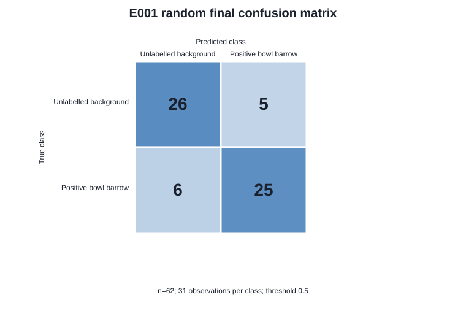
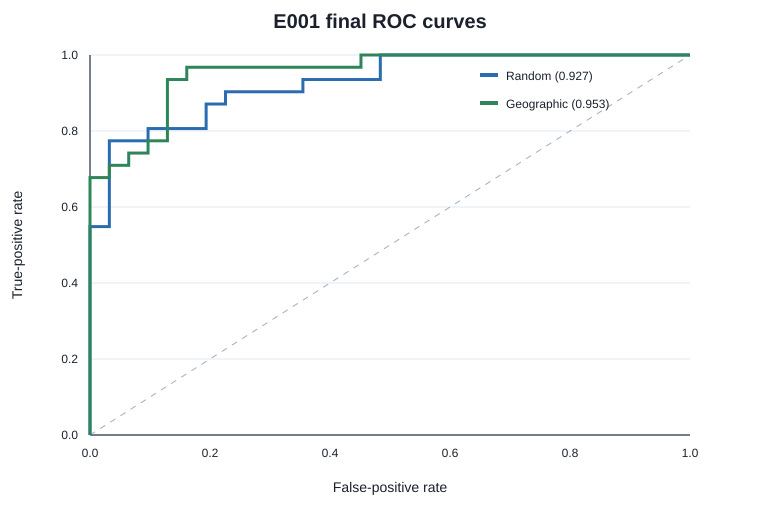
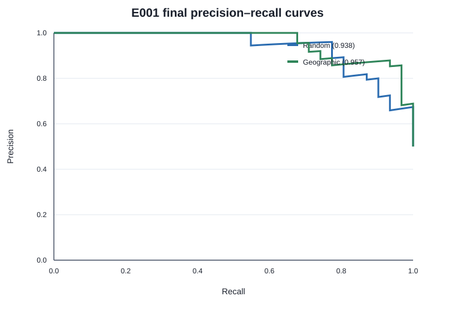

# E001 Phase 2D — frozen baseline modelling and final evaluation

## Research question

Can a frozen, terrain-only baseline distinguish curated known bowl-barrow patches from matched
unlabelled background terrain when the final observations come from geographically held-out
regions?

This experiment classifies curated known bowl-barrow patches versus deterministically sampled
unlabelled background terrain. It does **not** demonstrate unknown-site discovery.

## Dataset and split design

E001 contains 261 `positive_bowl_barrow` observations and 261 `unlabelled_background`
observations. Backgrounds were sampled deterministically with 500 m positive-site, 250 m known
Scheduled Monument, and 256 m background-spacing exclusions, then matched to positives by coarse
geography and terrain-acquisition provenance. Unknown terrain is not treated as confirmed absence
of archaeology.

Both frozen conditions contain 216/14/31 observations per class in train/development/final test.
The random condition keeps matched and overlapping observations grouped. The geographic condition
uses `BNG_100KM_E2_N0` for development and the nonadjacent `BNG_100KM_E3_N2` and
`BNG_100KM_E5_N4` blocks for final testing. Seven retained overlap components remain wholly within
one partition. Dataset audits found no duplicate patch digest, cross-partition window overlap, or
geographic cross-partition 1 km buffer violation.

## Final-test protection and selected model

Commit `790ac9f4b99da94e8f9bab2a6aed70b34ac88558` froze the primary model before final-test access.
The configuration SHA-256 is
`20cd377c17373eeeb5403c84119084287f193d93b42c8004d99c823e01a157e4`.
Commit `47d3629c0d91b20090addc1cc07bbb2460231847` then froze the one-way evaluation protocol before
scoring. A Windows timezone-data failure stopped before any final partition was loaded; timestamp-
only fix `b13edeb897e221acda2698848813b417e020c0e1` was committed before the successful unlock at
`2026-08-29T12:10:55+05:30`.

The primary baseline is a Random Forest with 300 trees, depth 8, minimum leaf size 5, square-root
feature sampling, one worker, and seed 20260829. Four pre-existing terrain representations—median-
normalized elevation, slope, fixed hillshade, and local relief—are each reduced from 128×128 to
32×32 using deterministic non-overlapping 4×4 means and concatenated to 4,096 features. The
threshold stayed fixed at 0.5. No metadata, coordinate, identifier, path, or filename is a feature.

Geographic development balanced accuracy was 0.821429 (14 observations per class), which selected
this configuration under the committed rule. No model choice below uses a final score.

## Final results

The geographic result is the primary E001 endpoint; random is a secondary descriptive comparison.
Intervals are percentile 95% intervals from 5,000 deterministic bootstrap resamples of whole
observational/overlap groups (seed 20260835).

| Metric | Random final | Geographic final |
|---|---:|---:|
| n (positive / background) | 62 (31 / 31) | 62 (31 / 31) |
| Balanced accuracy | 0.822581 | **0.870968** |
| Balanced-accuracy 95% CI | [0.718750, 0.916667] | **[0.774194, 0.951613]** |
| Accuracy | 0.822581 | 0.870968 |
| Precision | 0.833333 | 0.870968 |
| Recall | 0.806452 | 0.870968 |
| F1 | 0.819672 | 0.870968 |
| ROC-AUC | 0.927159 | 0.953174 |
| Average precision | 0.937686 | 0.956933 |

Random-minus-geographic balanced accuracy is **−0.048387**. By the pre-specified sign convention,
a positive value would mean geographic performance was lower. Here the geographic estimate is
4.84 percentage points higher. This is descriptive; no significance test was pre-specified.

## Confusion matrices

Rows are true classes and columns are predicted classes. A false positive means that the model
predicted `positive_bowl_barrow` for an E001 `unlabelled_background` observation; it does not prove
that the location contains no archaeology. A false negative is a curated known bowl-barrow example
classified as background.

| Random final | Predicted background | Predicted bowl barrow |
|---|---:|---:|
| True unlabelled background | 26 | 5 |
| True positive bowl barrow | 6 | 25 |

| Geographic final | Predicted background | Predicted bowl barrow |
|---|---:|---:|
| True unlabelled background | 27 | 4 |
| True positive bowl barrow | 4 | 27 |

## Uncertainty and secondary baselines

All 5,000 bootstrap replicates were defined for balanced accuracy, accuracy, F1, and ROC-AUC. The
random final partition contained 30 bootstrap units and the geographic final partition 31. The
geographic accuracy interval was [0.774194, 0.951613], F1 interval [0.774194, 0.952381], and ROC-AUC
interval [0.894901, 0.990635]. Random equivalents were [0.718750, 0.916667], [0.711864, 0.915254],
and [0.858463, 0.976563].

No secondary model was evaluated on either final test. The other Phase 2D-A candidates were
pre-specified for development selection, not explicitly authorized for secondary final evaluation.

## Error analysis

The frozen geographic model classified 54/62 observations correctly. Errors were evenly counted
across the two holdout blocks: 4/32 in `BNG_100KM_E3_N2` and 4/30 in `BNG_100KM_E5_N4`. Overall,
the geographic confusion matrix also split errors evenly: four background observations predicted as
bowl barrows and four curated positives predicted as background.

Geographic errors occurred in 7/42 observations from the largest 2020 provenance group and 1/8 in
the 2019 group; the remaining 12-observation 2018 group had no error. These strata are small and
confounded with place, so they do not support a causal explanation. Error observations had median
patch elevation 172.70 m versus 159.71 m among correct observations, median mean-slope 3.91° versus
4.31°, and median mean-absolute local relief 0.145 m versus 0.177 m. With only eight errors these are
descriptions, not stable failure predictors. Every final patch had zero missing cells.

Hard-relief, forestry, and road/track flags were not available consistently for all final
observations and were not inferred after seeing results. Any richer, independently specified error
annotation belongs to a later robustness phase.

## Shortcut audit

- Positive and background counts remain exactly matched within every final coarse BNG group,
  provenance ID, survey year, and source resolution stratum.
- Every final source resolution is 1 m, so resolution cannot separate classes within these tests.
- Both classes use the same NPZ schema, checksum verification, representation functions, pooling,
  and feature order. Paths and filenames are routing inputs only and never enter the estimator.
- Raw absolute elevation is not a feature; the elevation channel is normalized per patch. Aggregate
  raw elevation was inspected only after metrics were frozen.
- All final patches had zero missing terrain cells, so missingness cannot explain final predictions.
- No coordinate, exact location, sample identifier, private path, or sample-level prediction appears
  in tracked results or figures.

These checks rule out the listed direct shortcuts but cannot prove that every landscape or survey
confound has been eliminated.

## Sanity check and limitations

The Phase 2D-A development-only label-permutation diagnostic remains unchanged: five runs averaged
0.528571 balanced accuracy (range 0.428571–0.714286). It was not repeated on either final test and
did not tune the final system.

The final geographic set contains only two coarse blocks and 31 observations per class. The labels
are curated Scheduled Monument records rather than unquestionable ground truth, the unlabelled
background exclusion is necessarily incomplete, 40 entries still await independent human review,
and the reference CPython 3.12 reproduction remains outstanding. The results therefore do not
establish performance across England, across other earthwork classes, or on unknown terrain.

## Interpretation and decision

The frozen baseline retained discrimination on these two specific geographically held-out groups;
its geographic result did not show the anticipated drop relative to the random comparison. This is
evidence for the bounded E001 classification task, not evidence of archaeological discovery or a
national detection system.

**Decision: GO FOR PHASE 2E ROBUSTNESS / STRONGER MODELS.** Phase 2E should test whether the result
survives independent label review, additional geographic group designs, representation/resolution
sensitivity, and a separately pre-registered stronger model. It must not reinterpret this final
test as a new development set.
