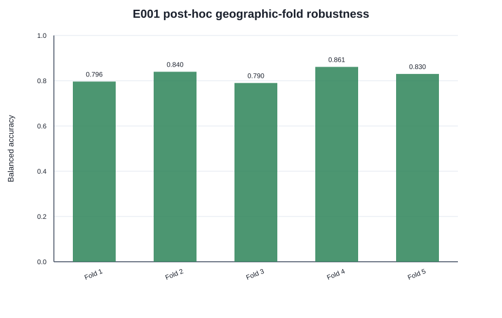
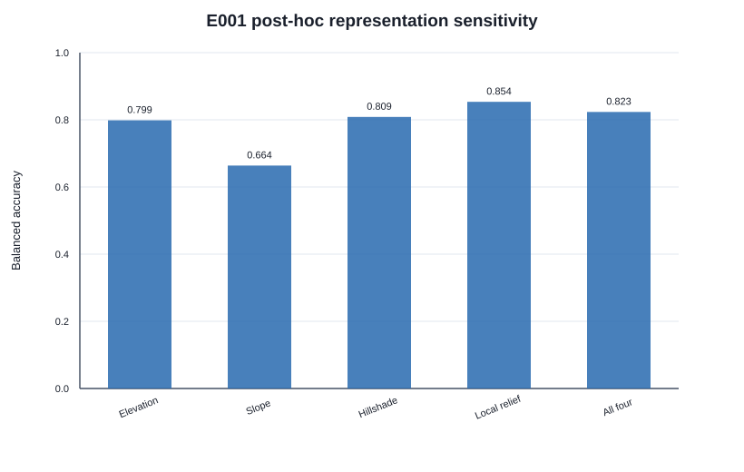
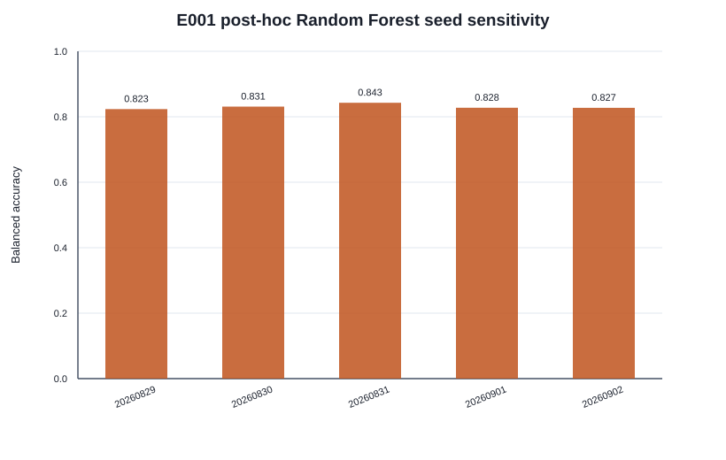
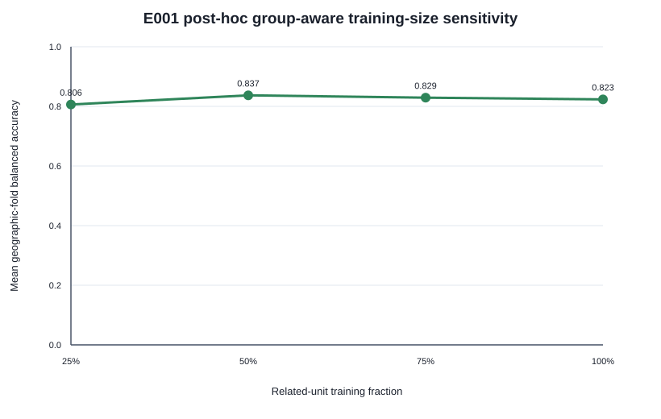
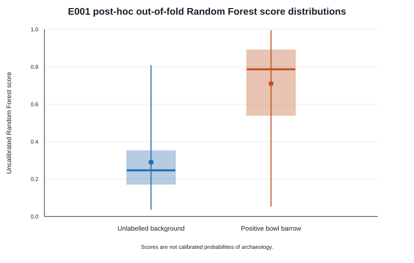

# E001 Phase 2E-A — post-hoc robustness, sensitivity, and failure analysis

## Confirmatory result remains Phase 2D

The primary E001 result remains the pre-specified Phase 2D geographic final-test balanced accuracy
of **0.870968**, with whole-group bootstrap 95% CI **[0.774194, 0.951613]**. It was computed on 62
observations from two frozen geographic groups after model selection commit
`790ac9f4b99da94e8f9bab2a6aed70b34ac88558`.

Every result below is labelled `posthoc_geographic_robustness`. The original final observations had
already been seen. Phase 2E did not make them unseen again, replace the confirmatory estimate, or
select a new model, threshold, background policy, representation, or preprocessing design.

## Fold design

All 23 occupied BNG 100 km groups were assigned to five folds without model scores. Whole groups
were ordered by descending observation count, descending related-unit count, then group ID, and
greedily placed into the smallest fold. The resulting folds contain 100–108 observations and are
exactly balanced by class. Matched positive/background observations and all seven overlap components
remain together. A private coordinate audit found zero cross-fold 128 m terrain-window overlaps.

Assignment SHA-256:
`825eb1088a53f764f991bf6bb22f2c9fe6eeb868916a5abab92012eed85d90ab`.

## Primary fixed-model geographic robustness

Every fold used the frozen Random Forest: 300 trees, depth 8, minimum leaf 5, square-root feature
sampling, one worker, seed 20260829, threshold 0.5, and all four pooled representations.

| Fold | Positive / background | BNG groups | Balanced accuracy | Accuracy | Precision | Recall | F1 | ROC-AUC | Average precision | TN / FP / FN / TP |
|---|---:|---:|---:|---:|---:|---:|---:|---:|---:|---:|
| 1 | 54 / 54 | 5 | 0.796296 | 0.796296 | 0.785714 | 0.814815 | 0.800000 | 0.914266 | 0.927970 | 42 / 12 / 10 / 44 |
| 2 | 53 / 53 | 5 | 0.839623 | 0.839623 | 0.821429 | 0.867925 | 0.844037 | 0.930224 | 0.947692 | 43 / 10 / 7 / 46 |
| 3 | 50 / 50 | 4 | **0.790000** | 0.790000 | 0.871795 | 0.680000 | 0.764045 | 0.902800 | 0.907070 | 45 / 5 / 16 / 34 |
| 4 | 54 / 54 | 5 | **0.861111** | 0.861111 | 0.897959 | 0.814815 | 0.854369 | 0.941358 | 0.946294 | 49 / 5 / 10 / 44 |
| 5 | 50 / 50 | 4 | 0.830000 | 0.830000 | 0.883721 | 0.760000 | 0.817204 | 0.892400 | 0.919894 | 45 / 5 / 12 / 38 |

Balanced-accuracy mean was **0.823406**, median **0.830000**, population standard deviation
**0.026755**, minimum **0.790000**, and maximum **0.861111**. No fold was hidden or removed.

## Region sensitivity

Under the single frozen out-of-fold prediction per observation, the easiest coarse groups were
`BNG_100KM_E6_N1` (1.000; n=10), `E5_N1` (0.916667; n=24), and `E3_N4` (0.888889; n=18). The
hardest were `E4_N1` and `E4_N4` (both 0.727273; n=22), followed by `E2_N0` (0.750000; n=28).
These are coordinate-safe descriptive results, not a basis for excluding regions.

Group estimates with the fewest observations—especially `E6_N3` (n=6), `E5_N0` (n=8), and
`E6_N1` (n=10)—are intrinsically the most statistically unstable even when their observed score is
high. The protocol did not generate repeated seed estimates for each individual group, so it does
not pretend to quantify group-specific seed variance.

## Representation sensitivity

These are secondary post-hoc comparisons, not confirmatory model selection.

| Representation | Mean balanced accuracy | SD | Minimum | Maximum |
|---|---:|---:|---:|---:|
| Normalized elevation | 0.798521 | 0.037475 | 0.740000 | 0.833333 |
| Slope | 0.663783 | 0.048090 | 0.630000 | 0.759259 |
| Hillshade | 0.808556 | 0.033214 | 0.768519 | 0.850000 |
| Local relief | **0.853577** | 0.036241 | 0.800000 | 0.905660 |
| All four, frozen primary input | 0.823406 | 0.026755 | 0.790000 | 0.861111 |

Local relief was the strongest individual channel, while slope alone was materially weaker. This
does not retroactively replace the frozen all-four input.

### Drop-one analysis

| Input | Mean balanced accuracy | SD | Minimum | Maximum |
|---|---:|---:|---:|---:|
| All minus elevation | 0.836657 | 0.027896 | 0.790000 | 0.877358 |
| All minus slope | 0.836657 | 0.028705 | 0.800000 | 0.877358 |
| All minus hillshade | 0.831180 | 0.023999 | 0.800000 | 0.858491 |
| All minus local relief | **0.802295** | 0.036182 | 0.750000 | 0.839623 |

Removing local relief caused the largest mean reduction, consistent with its strong single-channel
result. Removing elevation, slope, or hillshade did not reduce the post-hoc mean, suggesting some
redundancy; it is not evidence for a new selected configuration.

Flattened pooled-feature Pearson correlations were moderate between normalized elevation and local
relief (0.557). All other cross-representation absolute correlations were at most 0.220. This simple
diagnostic suggests partial but not complete linear redundancy.

## Seed sensitivity

| Random Forest seed | Mean balanced accuracy | SD | Minimum | Maximum |
|---:|---:|---:|---:|---:|
| 20260829 | 0.823406 | 0.026755 | 0.790000 | 0.861111 |
| 20260830 | 0.831066 | 0.026106 | 0.800000 | 0.867925 |
| 20260831 | 0.842770 | 0.018086 | 0.820000 | 0.867925 |
| 20260901 | 0.827554 | 0.018847 | 0.796296 | 0.851852 |
| 20260902 | 0.827328 | 0.028599 | 0.790000 | 0.858491 |

The range across seed means was 0.019364, below the frozen 0.05 robustness limit. No best seed was
selected.

## Training-size sensitivity and learning curve

Training subsets rank whole overlap/observational units by a deterministic SHA-256 rule within each
fold; classes stay balanced and related observations never split.

| Related-unit training fraction | Mean balanced accuracy | SD | Minimum | Maximum |
|---:|---:|---:|---:|---:|
| 100% | 0.823406 | 0.026755 | 0.790000 | 0.861111 |
| 75% | 0.829153 | 0.024537 | 0.800000 | 0.870370 |
| 50% | 0.836997 | 0.016918 | 0.810000 | 0.851852 |
| 25% | 0.806233 | 0.021093 | 0.780000 | 0.833333 |

Performance remained above 0.78 in every tested fraction/fold. The non-monotonic means show that
this small deterministic curve cannot support aggressive extrapolation: more labelled data may help
coverage and uncertainty, but the observed curve does not establish a simple scaling law.

## Probability-score stability

Out-of-fold scores for `positive_bowl_barrow` had median 0.786, interquartile range 0.541–0.890,
and mean 0.710. `unlabelled_background` scores had median 0.247, interquartile range 0.173–0.351,
and mean 0.290. The distributions overlap substantially, including individual values on the other
side of threshold 0.5.

These Random Forest outputs are uncalibrated classifier scores. A score of 0.90 does **not** mean a
90% probability that archaeology exists.

## Error and confound stability

The primary robustness predictions classified 430/522 observations correctly. Correct and error
sets had very similar aggregate terrain summaries: median absolute patch elevation 131.32 m versus
128.59 m, median mean slope 3.90° versus 3.64°, and median mean-absolute local relief 0.1536 m versus
0.1539 m. Every patch had zero missing cells.

Positive and background counts remained exactly matched within every coarse BNG group, provenance
ID, survey year, and source-resolution stratum. All observations used 1 m terrain. Error rates varied
descriptively between categories, but categories are geographically confounded and do not establish
causal failure mechanisms. Complete forestry, road/track, field-boundary, and hard-relief flags were
not available and were not inferred after predictions.

No hard-background dataset was constructed. Choosing difficult backgrounds from observed errors
would be biased, while collecting a newly specified background dataset is outside Phase 2E-A.

## Shortcut and invariance audits

- Raw absolute elevation is absent from model features. Elevation is median-normalized independently
  within each patch.
- A synthetic constant-offset test confirmed that adding 1,234.5 m leaves normalized elevation
  unchanged within numerical tolerance.
- Feature arrays are identical across positive/background directory names, filename changes,
  compressed versus uncompressed NPZ files, and reversed NPZ key order.
- Sample IDs, paths, filenames, compression sizes, NPZ metadata, provenance, year, BNG group, and
  source resolution never enter the estimator.
- All original Phase 2D result files retained their frozen SHA-256 hashes.
- Geographic groups, matched observations, and overlap components remain intact; cross-fold terrain
  overlap count is zero.

No direct shortcut audit failed. These checks cannot eliminate every possible landscape correlate.

## Confidence-interval and permutation robustness

The original Phase 2D geographic group bootstrap was repeated with seeds 20260835, 20260836, and
20260837. All three 5,000-resample runs returned the same rounded balanced-accuracy interval:
[0.774194, 0.951613], with no undefined replicate.

Exactly 100 fixed training-label permutations were run on the original geographic
train/development condition. Mean balanced accuracy was 0.518214, median 0.500000, range
0.285714–0.785714. None reached the selected development score 0.821429; the pre-specified
exploratory plus-one tail fraction was 1/101 = 0.009901. This is a diagnostic, not a new
confirmatory significance test.

## Limitations

- Geographic folds use coarse 100 km groups from one curated earthwork class and one country.
- Group sizes vary, and several group-level estimates are very small.
- Background terrain is unlabelled, not confirmed archaeology-free.
- Forty label records still await independent human review.
- CPython 3.12 and independent-person reproduction remain outstanding.
- No additional hard-background condition or Random Forest capacity diagnostic was performed.
- Phase 2E reuses the complete observed dataset and cannot supply a new untouched final result.

## Classification and recommendation

The score-independent rule classified E001 as **ROBUST**: geographic CV mean exceeded 0.70, every
fold exceeded 0.60, seed-mean range was below 0.05, the 50% training mean exceeded 0.65, and no
direct shortcut audit failed.

**Recommendation: GO FOR PHASE 2E-B STRONGER MODELS.** Any stronger-model comparison must be newly
pre-registered, must keep the Phase 2D result primary, and must not use the observed Phase 2D final
set for selection or tuning.
