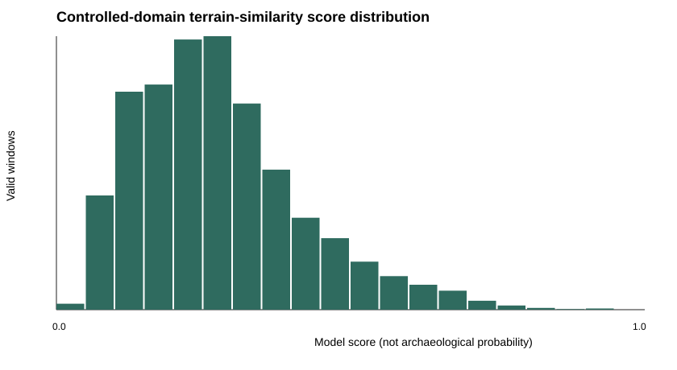

# E001 Phase 2F-B: first controlled private inference

## Status and boundary

**READY FOR BLINDED HUMAN MORPHOLOGY REVIEW.** Exactly one privately bound 5 km × 5 km domain
was processed with the frozen Phase 2F-A protocol. Its extent, terrain raster, complete score table,
ranked representatives, review images, and review mapping remain in Git-ignored private storage.
No human morphology review or heritage-record cross-check has occurred.

This phase ranks terrain similarity. It does not identify archaeological sites, estimate
archaeological probability, or claim a discovery. A score of 0.90 does not mean there is a 90%
chance archaeology exists.

## Frozen execution

The run retained the precommitted Random Forest without retraining or tuning: 300 trees, maximum
depth 8, minimum leaf size 5, `sqrt` feature sampling, and seed 20260829. The model-state SHA-256
remained `e3b0c072f437e889f09a2a2cf5a37f19b2f483eb5188e102b132a89ee76d1939`; the frozen
configuration SHA-256 remained
`20cd377c17373eeeb5403c84119084287f193d93b42c8004d99c823e01a157e4`.

The private domain used the Environment Agency 1 m LiDAR Composite DTM in EPSG:27700. Its extent
was selected and written to an ignored receipt before acquisition or scoring. A private overlap
audit found no overlap with any frozen E001 training or evaluation window. The grid contained the
expected 5,929 pre-QA windows: 128 m × 128 m patches at 64 m stride in row-major order.

Every window passed the frozen terrain and representation QA. Each used normalized elevation,
slope, fixed hillshade, and local relief, followed by non-overlapping 4 × 4 mean pooling to 4,096
terrain-only features. The complete private score table was written and hash-frozen before score
summaries, spatial deduplication, or queue construction. Its SHA-256 is
`78434f3518bd8aa5fb83e3dd9f7c3d54288e1f31a5e61618df4541bb40977771`.

## Coordinate-safe aggregate result

| Quantity | Aggregate result |
|---|---:|
| Pre-QA windows | 5,929 |
| Valid windows | 5,929 |
| Rejected / no-data windows | 0 / 0 |
| Minimum model score | 0.037748 |
| Mean model score | 0.278542 |
| Median model score | 0.258192 |
| 95th percentile | 0.557513 |
| 99th percentile | 0.695160 |
| Maximum model score | 0.945270 |
| Post-dedup representatives | 1,159 |
| HIGH / MEDIUM / RANDOM review items | 12 / 25 / 25 |

The run took 39.844 seconds on the recorded Windows development environment, including 27.625
seconds for bounded terrain acquisition, 9.941 seconds for representation generation and pooling,
and 0.252 seconds for model scoring. These timings describe this single run and are not a general
service benchmark.

## Blinded-review handoff

The private packet contains 62 non-georeferenced hillshade images in a deterministic blinded
order. Its reviewer-facing manifest exposes only a blind ID, image filename, empty category, empty
notes, allowed morphology categories, and instructions. Model score, rank, queue band, private
window token, raster-relative offset, exact location, and known heritage status are retained only
in a separate ignored mapping.

The next allowed action is blinded human morphology review. Historic England or other heritage
records must not be checked until that review is frozen. Results must not be used to retune the
model, alter thresholds, select another domain, or claim archaeological discovery.

## Public evidence

The authoritative coordinate-safe aggregate receipt is
`outputs/inference/e001_phase2f_b_summary.json`. The frozen Phase 2F-A protocol SHA-256 remains
`fa1f9cd12230df3f7c83c45febd5ec0ba751f371a098600873380bc47c624095`.
