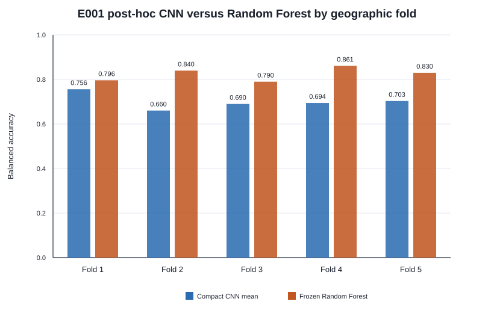
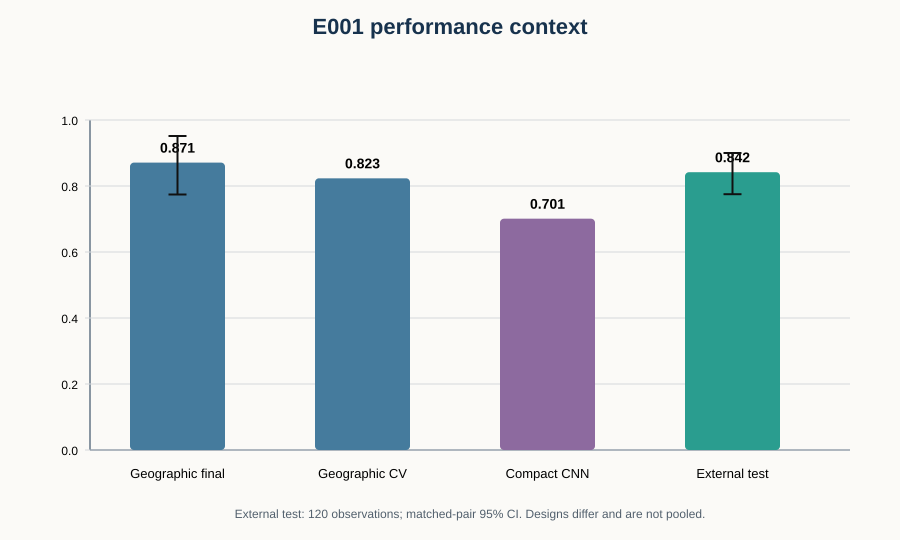
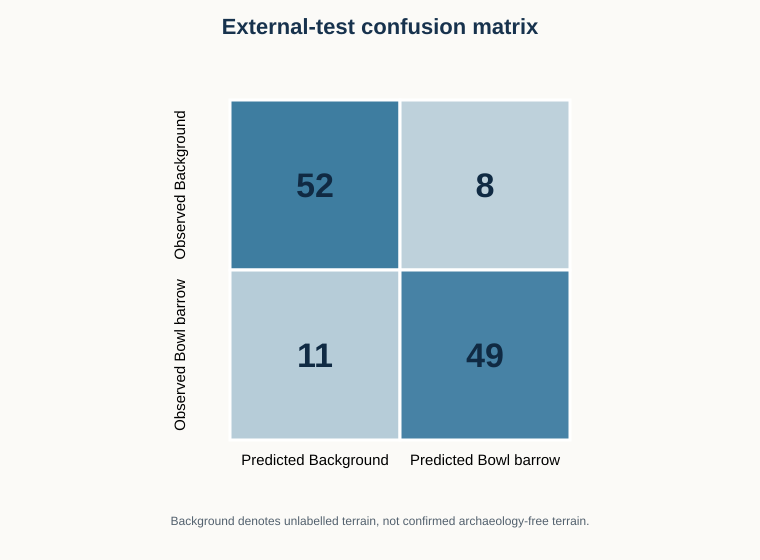
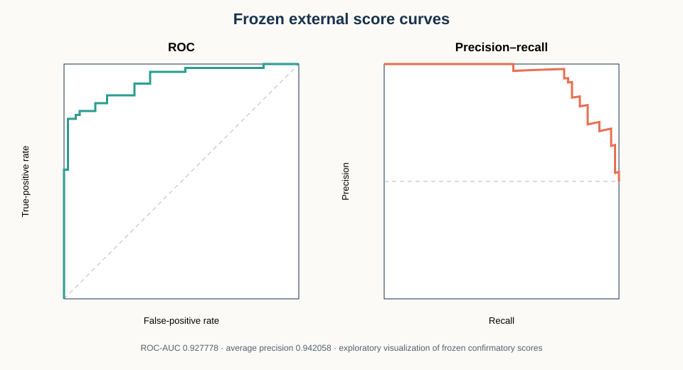
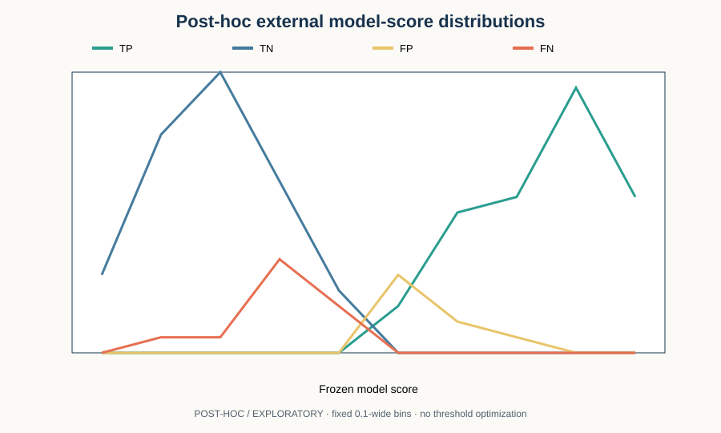
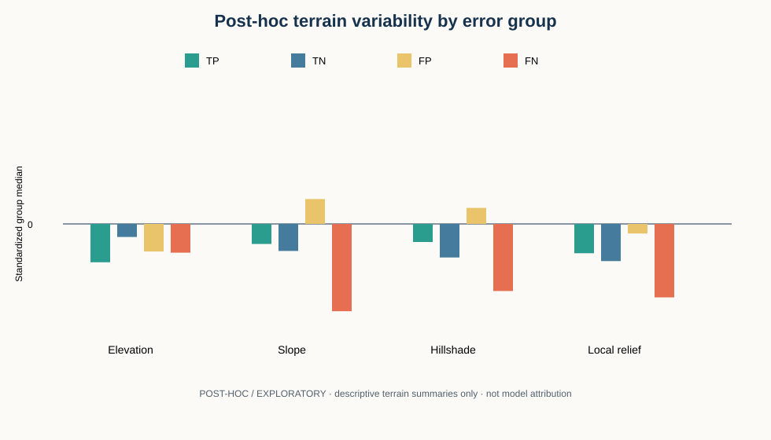

# Geographic generalization of a terrain-only Random Forest for documented bowl-barrow classification

## Abstract

Machine-learning studies of archaeological terrain can produce optimistic results when nearby
samples share landscape, acquisition, or processing characteristics across training and evaluation
partitions. ArchaeoAI E001 therefore asked a narrow question: can a terrain-only model distinguish
LiDAR-derived patches centred on documented, scheduled, surviving single bowl barrows from matched
`unlabelled_background`, and does that signal persist under geographically separated evaluation?
The study curated 261 positive records from official Historic England entries and paired them with
261 deterministic background patches matched by coarse geography and terrain provenance. Each
128 m × 128 m Environment Agency digital terrain model patch was represented by median-normalized
elevation, slope, fixed-illumination hillshade, and 16 m local relief. Spatial overlap components,
matched groups, and pre-specified geographic blocks were kept intact across evaluation partitions.
A development-only comparison selected a 300-tree Random Forest using 4 × 4 mean-pooled versions
of all four terrain representations. On the frozen E001 geographic final test, comprising 62
observations in two pre-specified blocks, balanced accuracy was 87.1% (group-bootstrap 95% interval
77.4–95.2%). A post-hoc five-fold geographic robustness analysis averaged 82.3%, whereas a frozen
compact convolutional neural network averaged 70.1% on the same folds. The frozen Random Forest
achieved **84.2% balanced accuracy (95% paired-bootstrap CI 77.5–90.0%) in a one-time independent
external evaluation of 120 observations across five pre-specified geographic cells**. This
evaluates classification of documented bowl-barrow terrain versus matched unlabelled background;
it is not archaeological-discovery accuracy. The external test is now spent. Post-hoc error
analysis suggested that weaker terrain variability was associated with false negatives and more
variable background terrain with false positives, but those findings are exploratory. E001
supports a reproducible terrain-classification signal under the evaluated conditions while also
showing why spatial separation, uncertain backgrounds, privacy controls, and bounded claims are
essential in archaeological machine learning.

## 1. Introduction

Airborne light detection and ranging (LiDAR) can produce detailed models of ground morphology,
including in settings where vegetation or subtle relief makes conventional observation difficult.
Historic England describes metre- and sub-metre-resolution lidar as useful for recognizing slight
earthwork remains, while emphasizing its place within archaeological recording and interpretation
rather than as an autonomous conclusion-making system [Historic England 2024]. A systematic review
of 291 journal studies likewise found that archaeological LiDAR results vary with material culture,
vegetation, acquisition resolution, and the availability of open institutional data [Vinci et al.
2024]. These properties make LiDAR a promising but context-dependent input for computational
analysis.

Automated archaeological mapping is not new. Faster R-CNN workflows have been applied to barrows
and Celtic fields in Dutch LiDAR [Verschoof-van der Vaart and Lambers 2019], and deep segmentation
has been used to delineate topographic anomalies in French data [Guyot et al. 2021]. Consequently,
E001 does not claim novelty from applying machine learning to LiDAR or from inventing a new neural
architecture. Its focus is methodological: transparent data construction, leakage-resistant
geographic evaluation, comparison of a simple pooled-terrain baseline with one compact CNN, and an
independent external test whose use was fixed in advance.

The central risk is spatial dependence. Nearby patches can share geology, land use, survey year,
interpolation history, vegetation-removal artifacts, and even overlapping pixels. A conventional
random split can place related examples on both sides of an evaluation boundary. The resulting
metric may describe interpolation within familiar spatial contexts rather than transfer to a new
area. E001 therefore treats geographic separation as a first-class experimental variable and
tracks acquisition provenance alongside class labels.

The project also treats responsible archaeology as part of method quality. Precise monument
locations and private terrain are withheld from the repository. Public outputs contain aggregate
statistics, coarse evaluation groups, and coordinate-safe figures. Model scores are classifier
scores, not probabilities of archaeology, and the work makes no claim to have discovered a site.

## 2. Research question

The primary question was:

> Can a model distinguish terrain patches centred on documented, surviving single bowl barrows
> from geographically and acquisition-matched unlabelled background, and does its performance
> persist when evaluation groups are geographically separated from model development?

Three supporting questions followed. First, how much does the apparent result depend on the input
representation and model family? Second, does the selected baseline remain stable across multiple
geographic folds rather than only two final blocks? Third, does the unchanged model transfer to a
separately constructed, independently located external dataset? These questions were addressed in
separate phases so that later evidence could not retroactively change earlier selection rules.

## 3. Data and target definition

The target class was narrowly defined as scheduled, surviving, single bowl barrows documented in
the National Heritage List for England. “Bowl barrow” was not treated as a synonym for every round
mound, funerary monument, or possible archaeological anomaly. The curation gate required evidence
from the official entry that the record represented the intended monument form and retained
upstanding relief suitable for a terrain study. Cropmark-only records, non-bowl-barrow monuments,
cairns, entries lacking adequate evidence, and sites without suitable terrain coverage or
unconfounded provenance were excluded or held for review.

The positive class is therefore a curated research class, not unquestionable ground truth. The
official inventory reflects designation, survival, documentation, and historical research
processes. Undocumented or undesignated examples are not represented by the same mechanism. E001
tests whether a repeatable terrain pattern exists for this curated class; it does not estimate the
prevalence of bowl barrows or evaluate every possible preservation state.

| E001 dataset component | Count | Interpretation |
|---|---:|---|
| Official entries reviewed | 360 | Full-entry curation queue |
| Accepted positive records | 261 | Curated documented bowl-barrow terrain |
| Matched unlabelled backgrounds | 261 | Unknown terrain, not confirmed negatives |
| Total observations | 522 | Frozen modelling dataset |
| Coarse 100 km geographic groups | 23 | Used for grouping and geographic analysis |
| Observation groups | 254 | Matched and overlap-aware assignment units |
| Overlap components | 7 | Kept intact across partitions |

## 4. Positive curation

Every one of 360 candidate records was checked against its Historic England entry. The frozen gate
accepted 261, rejected 25, marked 27 uncertain, and routed 47 to terrain-provenance review. Accepted
records passed class, single-monument, relief-survival, designation-geometry, 128 m terrain-
coverage, and single-provenance requirements. The source snapshot was accessed on 27 August 2026.
The 261 records occupied 23 coarse British National Grid groups.

Curation preceded raster modelling. The public curation summary contains stable record IDs and
aggregate groups but no exact coordinates or geometry. A 40-record second-review queue was frozen
for a different reviewer; that independent review remains incomplete. This unresolved review is a
limitation rather than a reason to revise labels after seeing model results.

## 5. Matched unlabelled backgrounds

A terrain location with no recorded monument is not necessarily archaeology-free. E001 therefore
uses the label `unlabelled_background`, not “true negative terrain.” One background was generated
for each positive. Candidate centres were sampled deterministically 1–5 km from the paired positive
and were required to remain within the same coarse geographic group and exact terrain-provenance
stratum. They had to be at least 500 m from accepted positives, 250 m from known Scheduled
Monuments, and 256 m from other selected backgrounds.

The Scheduled Monument exclusion is necessarily incomplete: it filters a specific public
inventory, not every known or unknown archaeological feature. Realistic difficult terrain was not
removed simply because it resembled a mound, track, field boundary, or forestry feature. This
preserves a more credible background class but also changes interpretation of false positives. A
false-positive classification means that the model assigned an unlabelled patch to the positive
class under the fixed threshold; it does not prove the patch lacks archaeology.

Candidate generation considered 573 cumulative candidates to select 261 backgrounds. All selected
patches passed terrain and representation QA. Class counts were exactly matched within observed
coarse geography and provenance strata, reducing direct count-based shortcuts from those metadata.

## 6. Terrain processing

Terrain came from the Environment Agency LiDAR Composite digital terrain model under the Open
Government Licence. Patches used EPSG:27700, nominal 1 m resolution, and a 128 × 128 grid covering
128 m × 128 m. Raw and processed rasters remained private. Checksums linked each cached source and
derived representation to a coordinate-safe index.

Four frozen representations were generated:

1. **Median-normalized elevation**, formed by subtracting the patch median so absolute elevation
   was not a direct feature.
2. **Slope in degrees**, derived deterministically from the terrain surface.
3. **Hillshade**, using fixed 315° azimuth and 45° altitude.
4. **Local relief**, subtracting a 16 m-scale smoothed surface from local elevation.

For classical models, non-overlapping 4 × 4 mean pooling converted each 128 × 128 representation
to 32 × 32, or 1,024 features. Concatenating all four produced 4,096 terrain-only features. IDs,
coordinates, filenames, paths, geographic groups, survey years, source resolution, and provenance
were excluded as model inputs.

## 7. Leakage-resistant geographic evaluation

E001 froze two evaluation conditions before final scoring. Both used 216 training, 14 development,
and 31 final-test observations per class. The group-aware random condition preserved matched and
overlap units while distributing them without a complete geographic-block holdout. The geographic
condition held out complete coarse blocks, with the final test formed by two nonadjacent 100 km
groups containing 31 positives and 31 backgrounds in total.

No overlap component crossed a partition. The dataset audit found zero duplicate sample IDs,
duplicate patch-content digests, positive/background buffer violations, background-spacing
violations, cross-partition terrain-window overlaps, or geographic final-boundary buffer
violations. Frozen assignment digests guarded both split manifests. Development results could
select the model, but final partitions remained unavailable until a separate protocol and commit.

| Evaluation design | Role | Evaluation size | Geographic separation |
|---|---|---:|---|
| Geographic development | Model selection | 28 | Complete development block |
| Geographic final | Primary E001 confirmatory test | 62 | Two pre-specified nonadjacent blocks |
| Group-aware random final | Secondary comparison | 62 | Groups intact; no complete-block holdout |
| Five-fold geographic CV | Post-hoc robustness | 100–108 per fold | All 23 coarse groups assigned once |
| Independent external | One-time independent test | 120 | Five pre-specified 25 km cells, ≥15 km exclusions |

These designs answer related but different questions. Their metrics are reported separately and
are not pooled.

## 8. Random Forest model

A pre-registered development matrix compared DummyClassifier, L2 Logistic Regression, and a modest
Random Forest across normalized elevation, slope, hillshade, local relief, and all-four inputs. The
primary criterion was geographic-development balanced accuracy. Differences below 0.02 were
treated as effective ties, with preference first for Logistic Regression and then for fewer
channels. ROC-AUC was secondary only.

The all-four Random Forest achieved 0.821429 development balanced accuracy, compared with 0.785714
for the next-best candidates. The 0.035715 difference exceeded the tie band, so the Random Forest
was frozen before any final-test evaluation.

| Parameter | Frozen value |
|---|---|
| Trees | 300 |
| Maximum depth | 8 |
| Minimum samples per leaf | 5 |
| Features considered per split | square root |
| Random seed | 20260829 |
| Input | All four representations |
| Pooling | Non-overlapping 4 × 4 mean |
| Feature count | 4,096 |
| Standard scaling | None |
| Classification threshold | 0.5 |

Five shuffled-training-label development runs averaged 0.528571 balanced accuracy. One reached
0.714286, so the exercise was retained as a small-sample diagnostic rather than described as a
formal significance test. Metadata count audits found no class imbalance by provenance, survey
year, coarse group, or source resolution in train/development.

## 9. CNN comparison

One compact CNN was frozen before training to test whether spatially local learned filters offered
an advantage at the available scale. The network accepted the four 128 × 128 representations,
used three convolution/ReLU/max-pooling blocks, adaptive average pooling, and a small fully
connected head. It contained 59,145 trainable parameters. AdamW, BCEWithLogitsLoss, a learning
rate of 0.001, weight decay 0.0001, batch size 16, maximum 100 epochs, and three fixed seeds were
pre-specified. Internal early stopping used only complete groups from the training portion of each
outer fold; the held-out geographic fold was never used for normalization or checkpoint choice.

Across five geographic folds and three seeds, all 15 runs completed and early-stopped. The mean CNN
balanced accuracy was 0.700866, compared descriptively with 0.823406 for the Random Forest on the
same folds. The CNN was weaker on every fold, with a mean difference of −0.122540. This result does
not show that CNNs are generally unsuitable for archaeological terrain. It shows that this one
compact architecture did not justify replacing the simpler model at the current E001 data scale.

| Model | Design | Mean balanced accuracy | Interpretation |
|---|---|---:|---|
| Random Forest | Five post-hoc geographic folds | 0.823 | Preferred baseline |
| Compact CNN | Same folds, three seeds | 0.701 | Not justified at current scale |

*Figure 1. Coordinate-safe post-hoc comparison on the same five geographic folds. Fold estimates
are not independent external tests.*

## 10. E001 geographic results

After the baseline configuration and final protocol were committed, the model was evaluated once
on the frozen final partitions. The primary geographic final balanced accuracy was 0.870968 on 62
observations, with a 5,000-resample whole-group percentile-bootstrap 95% interval of
[0.774194, 0.951613]. The group-aware random comparison was 0.822581 with interval
[0.718750, 0.916667]. Random-minus-geographic balanced accuracy was −0.048387 in this experiment.

The absence of an expected random advantage does not invalidate the geographic design. The
geographic result is still restricted to two specific blocks, and the intervals overlap. The
important protection is that the groups and model were selected without seeing final labels or
metrics. E001 therefore retains 0.870968 as its primary within-dataset confirmatory result rather
than replacing it with later cross-validation or external evidence.

*Figure 2. Frozen final-condition balanced accuracy with group-bootstrap uncertainty. The random
and geographic conditions answer different spatial-generalization questions.*

## 11. Five-fold geographic robustness

Phase 2E-A assigned all 23 coarse groups to five score-independent folds. This analysis was labelled
`posthoc_geographic_robustness`, not a new untouched test. Fold balanced accuracies were 0.796,
0.840, 0.790, 0.861, and 0.830, giving a mean of 0.823406, population standard deviation 0.026755,
and range 0.790–0.861. Under the frozen rule, the result was classified `ROBUST` because the mean,
minimum fold, seed stability, reduced-training result, and direct-shortcut audits passed their
pre-committed conditions.

Representation analyses were exploratory. Local relief alone averaged 0.853577; all four averaged
0.823406. No representation was substituted into the already reported model because doing so
would use post-hoc evidence for reselection. Likewise, performance summaries for individual coarse
groups were treated as descriptive because many groups were small.

## 12. Independent external-validation design

Phase 3 asked whether the unchanged Random Forest transferred to geography excluded from E001 and
the private controlled-inference domain. The protocol fixed the monument class, model state,
representations, preprocessing, threshold, 60-pair target, 50-pair minimum, matched-pair bootstrap,
and outcome rule before external construction or scoring. Candidate cells had to pass 15 km
separation from all 522 E001 observations and from the Phase 2F private domain.

The first selected cell could not satisfy the 50-pair minimum under strict curation: 47 records
were accepted, with one terrain-review case unable to raise the maximum beyond 48. Construction
stopped rather than weakening the evidence gate. A separately frozen amendment then selected four
supplementary cells using metadata-only feasibility rules, still without model access. This staged
record matters because it shows that geography and sample size were not adjusted after observing
external predictions.

## 13. External dataset construction

The unchanged full-entry evidence rules accepted 29 of 33 supplementary candidates. Combined with
the original 47, 76 records were eligible. A deterministic SHA-256 rule selected exactly 60
positives. Each received one background matched within the same 25 km cell and exact terrain
provenance, using the same 1–5 km annulus, 500 m positive exclusion, 250 m known Scheduled Monument
exclusion, and 256 m background separation principles.

| External 25 km cell | Positives | Backgrounds | Total |
|---|---:|---:|---:|
| BNG_25KM_E16_N5 | 37 | 37 | 74 |
| BNG_25KM_E18_N4 | 5 | 5 | 10 |
| BNG_25KM_E19_N5 | 5 | 5 | 10 |
| BNG_25KM_E19_N6 | 9 | 9 | 18 |
| BNG_25KM_E20_N13 | 4 | 4 | 8 |
| **Total** | **60** | **60** | **120** |

All 120 patches passed raw and representation QA at 1 m resolution. The final dataset had no
sample-ID, centre, E001-content, external-content, or positive/background content collisions.
Five permitted terrain-window overlaps occurred between distinct positive records; no background
spacing or prior-study separation rule was violated. The dataset was frozen `READY_UNSCORED`
before the model was loaded.

## 14. One-time external evaluation

The Phase 3C authorization bound the already frozen dataset, model state, configuration, and
prediction-vector receipt. The full private score vector was written and checksummed before metric
calculation. No observation was removed, replaced, or relabelled after scoring, and no second
external scoring run occurred.

**The frozen Random Forest achieved 84.2% balanced accuracy (95% paired-bootstrap CI 77.5–90.0%)
in a one-time independent external evaluation of 120 observations across five pre-specified
geographic cells.** This evaluates classification of documented bowl-barrow terrain versus matched
unlabelled background. It is **not archaeological-discovery accuracy**.

| External measure | Frozen result |
|---|---:|
| Balanced accuracy | 0.841667 |
| 95% matched-pair bootstrap interval | [0.775, 0.900] |
| Accuracy | 0.841667 |
| Precision | 0.859649 |
| Positive recall | 0.816667 |
| Unlabelled-background recall | 0.866667 |
| F1 | 0.837607 |
| ROC-AUC | 0.927778 |
| Average precision | 0.942058 |

| Actual / predicted | Unlabelled background | Positive bowl barrow |
|---|---:|---:|
| Unlabelled background | TN = 52 | FP = 8 |
| Positive bowl barrow | FN = 11 | TP = 49 |

*Figure 3. Coordinate-safe context across distinct designs. Values are not pooled.*

*Figure 4. Confusion matrix for the single frozen external evaluation.*

*Figure 5. ROC and precision-recall curves from the frozen private external prediction vector.*

The result met the pre-specified `EXTERNAL_GENERALIZATION_SUPPORTED` rule: combined balanced
accuracy was at least 0.75 and the paired-bootstrap lower bound exceeded 0.5. The label describes
the protocol outcome, not proof of universal or England-wide generalization. The external test is
now spent and cannot serve as development data for the reported model.

## 15. Post-hoc / exploratory error analysis

Phase 4A is explicitly **POST-HOC / EXPLORATORY**. It grouped the frozen external vector into 49
true positives, 52 true negatives, 8 false positives, and 11 false negatives without rescoring.
True-positive model scores had median 0.820; true negatives 0.248; false positives 0.570; and false
negatives 0.338. These are terrain-similarity model scores, not probabilities of archaeology.

False negatives had lower median within-patch variability than true positives in slope (0.855
versus 2.233 degrees), hillshade (0.0148 versus 0.0289), and local relief (0.0956 versus 0.1816).
False-positive backgrounds had higher variability than true negatives in slope (3.153 versus
2.089), hillshade (0.0386 versus 0.0244), and local relief (0.220 versus 0.166). Nine of eleven false
negatives occurred in the largest external cell and the 2021 terrain stratum. However, geography,
sample composition, and survey year were confounded, error groups were small, and the analysis was
retrospective. These patterns motivate future hypotheses; they are not feature attributions,
causal effects, or a basis for changing the model.

*Figure 6. POST-HOC / EXPLORATORY model-score distributions by frozen outcome group.*

*Figure 7. POST-HOC / EXPLORATORY standardized group medians of patch variability; this is not
model-feature attribution.*

## 16. Limitations

E001 has a deliberately narrow scope and several material limitations.

- **One target class.** Results for scheduled, surviving single bowl barrows do not transfer
  automatically to cairns, ring ditches, field systems, enclosures, settlements, or subsurface
  archaeology.
- **Modest sample size.** The modelling dataset contains 522 observations, and the external test
  contains 120. Some geographic strata contain only four to nine matched pairs.
- **England-specific sources.** Label practices, designation history, terrain, land use, and public
  LiDAR acquisition reflect England and its heritage systems.
- **Unlabelled backgrounds.** Background patches are not known archaeological negatives. Public
  inventories and exclusion buffers cannot guarantee absence of undocumented remains.
- **Inventory selection.** Documented scheduled monuments may overrepresent visible, preserved,
  researched, or administratively designated examples.
- **Limited geographic coverage.** Two final E001 blocks and five external cells do not represent
  every landscape in England.
- **Uncalibrated scores.** Random-Forest outputs are model scores, not archaeological probabilities
  or calibrated uncertainty.
- **No field verification.** E001 did not conduct excavation, field survey, or independent on-site
  validation.
- **No new-site claim.** The study evaluates documented positives and matched backgrounds. It does
  not claim discovery of previously unknown archaeology.
- **Unreviewed private inference.** The Phase 2F blinded candidate packet remains unreviewed; no
  morphology assessment or heritage cross-check has occurred.
- **CNN scope.** The negative CNN comparison applies to one compact architecture at the current
  data scale, not to deep learning in general.
- **Spent external test.** Phase 3 cannot be reused to tune the current model. Training on it would
  define a new model generation requiring new independent data.
- **Exploratory errors.** Phase 4A associations are post-hoc and cannot support confirmatory or
  causal claims.
- **Reproduction gap.** The full pipeline has not yet been independently reproduced by another
  researcher, and CPython 3.12 remains the reference runtime despite local development on 3.14.7.

## 17. Responsible archaeology and privacy

Archaeological location data can be sensitive. The repository therefore separates coordinate-safe
research evidence from private spatial inputs. Exact centres, source geometries, private domain
extents, raw terrain, processed arrays, row-level external predictions, candidate tables, review
images, and model files are excluded from Git. Public group IDs are intentionally coarse and are
used to explain evaluation structure rather than expose monument locations.

Privacy tests scan tracked outputs for coordinate-bearing fields and sensitive file extensions.
Configuration loaders enforce contained paths, and `.gitignore` protects private and generated
spatial material. Coordinate-free figures show only aggregate metrics. The project does not publish
a candidate map, ranking, or record-level score.

Responsible wording is equally important. “Positive” means a curated documented bowl-barrow
patch. “Unlabelled background” means terrain not assigned the positive label under the study’s
sources and exclusions. A model classification is not an archaeological interpretation. Any
future candidate assessment would require blinded morphology review, lawful heritage-record
checking, archaeological expertise, and an explicit privacy decision.

## 18. Reproducibility

The repository uses an installable `src/` Python package, typed configuration, deterministic
sampling and processing, frozen JSON protocols, checksum-bound artifacts, regression tests, Ruff,
Windows verification scripts, and Linux GitHub Actions. The reference runtime is CPython 3.12;
supported development versions are `>=3.12,<3.15`. Frozen seeds, split hashes, model parameters,
fold assignments, software versions, and result receipts are retained beside coordinate-safe
outputs.

Reproduction has two levels. A public evidence audit can install the project, validate every
tracked configuration and aggregate result, run all tests, and regenerate checks that do not need
private coordinates or terrain. A full data reproduction additionally requires lawful retrieval
of the source records and Environment Agency terrain, reconstruction of private coordinates, and
regeneration of ignored patches under the documented procedures. The repository does not promise
redistribution rights for source-derived record-level or terrain material.

The manuscript evidence manifest binds this text to the Phase 3C result, external dataset,
prediction vector, Phase 4A aggregate, model state, and included figure bytes. It is a consistency
mechanism, not proof of independent replication.

## 19. Data availability

Source code and coordinate-safe aggregate evidence are available in the public ArchaeoAI
repository. Source-data provenance, access dates, licensing notes, curation rules, background
policy, preprocessing, and evaluation assignments are documented. Precise archaeological
locations are intentionally withheld. Raw or location-linked terrain, private manifests, external
prediction rows, inference candidates, and private review media are not published.

Historic England and Environment Agency information remains subject to its source terms and
attribution requirements. The repository does not grant or promise redistribution rights that have
not been verified. Researchers seeking to reproduce the private data layer must obtain source data
lawfully and apply their own institutional, legal, and ethical review.

## 20. Code availability

The Python source, tests, scripts, frozen configurations, coordinate-safe outputs, and CI workflow
are public in the repository. At the time of this manuscript package, the repository does not yet
have a repository-wide software licence; public visibility alone does not grant reuse rights. A
future release must resolve ownership, licensing, third-party notices, and version archival before
claiming a reusable software package or DOI. No GitHub release, preprint, DOI, or website deployment
is part of Phase 4B.

## 21. Discussion

Three findings shape the interpretation of E001. First, the terrain-only Random Forest retained a
substantial classification signal when evaluation geography was separated. The primary E001
geographic result, five-fold post-hoc robustness mean, and one-time external result were 0.871,
0.823, and 0.842 balanced accuracy respectively. Their similarity is encouraging, but the designs
and populations differ; agreement does not license pooling or an England-wide estimate.

Second, simplicity was valuable. The selected Random Forest used deterministic pooled terrain and
modest, fixed complexity. The compact CNN had access to full-resolution four-channel patches yet
underperformed on every geographic fold. At this scale, additional representation capacity did not
compensate for limited examples and geographic heterogeneity. A larger future study may reach a
different conclusion, but E001 provides no reason to promote a more complex model simply because
it is newer.

Third, external errors point toward scientifically useful next questions without justifying current
model changes. Weaker local terrain variability may make documented positives harder to classify,
while highly variable background may produce positive-like signatures. Future experiments could
pre-register relief strata, independently reviewed hard backgrounds, or alternate illumination
representations. If the Phase 3 dataset contributes to future training, that work must be labelled
a new model generation and evaluated on new independent geography.

The project’s strongest contribution is therefore not a detector or candidate list. It is a
traceable experimental record showing how a narrow archaeological terrain question can be studied
with explicit label uncertainty, provenance matching, spatial leakage controls, one-way result
gates, privacy boundaries, and useful negative evidence.

## 22. Conclusion

ArchaeoAI E001 found that an unchanged pooled-terrain Random Forest distinguished 60 independently
curated documented bowl-barrow patches from 60 matched unlabelled-background patches with 84.2%
balanced accuracy and a paired-bootstrap 95% interval of 77.5–90.0%. The result met its
pre-specified external-support rule and was consistent with, but distinct from, the earlier 87.1%
two-block geographic final result and 82.3% five-fold robustness mean. A compact CNN averaged
70.1% and did not justify replacing the Random Forest at the current scale.

These results support a bounded terrain-classification finding, not archaeological-discovery
accuracy. The background class remains uncertain, external geography is limited, no field
verification occurred, and the external test is spent. The appropriate next step is independent
review and reproducibility work, not post-hoc optimization of the reported model.

## References and citation-review status

- Guyot, A., Lennon, M., Lorho, T., and Hubert-Moy, L. (2021). “Combined Detection and
  Segmentation of Archeological Structures from LiDAR Data Using a Deep Learning Approach.”
  *Journal of Computer Applications in Archaeology*, 4(1), 1–19.
  <https://doi.org/10.5334/jcaa.64>
- Historic England (2024 update). “Lidar (Light Detection and Ranging).”
  <https://historicengland.org.uk/research/methods/airborne-remote-sensing/lidar/>
- Verschoof-van der Vaart, W. B., and Lambers, K. (2019). “Learning to Look at LiDAR: The Use of
  R-CNN in the Automated Detection of Archaeological Objects in LiDAR Data from the Netherlands.”
  *Journal of Computer Applications in Archaeology*, 2(1), 31–40.
  <https://doi.org/10.5334/jcaa.32>
- Vinci, G., Vanzani, F., Fontana, A., and Campana, S. (2024 online; volume 32 issue 1).
  “LiDAR Applications in Archaeology: A Systematic Review.” *Archaeological Prospection*, 81–101.
  <https://doi.org/10.1002/arp.1931>

`CITATION_REVIEW_REQUIRED`: the repository’s literature audit is preliminary rather than
systematic. Before submission, expand the search log, verify full bibliographic metadata and final
publication year conventions, resolve the previously noted Character et al. (2024) entry, and add
methodological citations for spatial validation, balanced accuracy, and paired bootstrap methods.
No unverified citation is used as substantive evidence in this manuscript draft.
